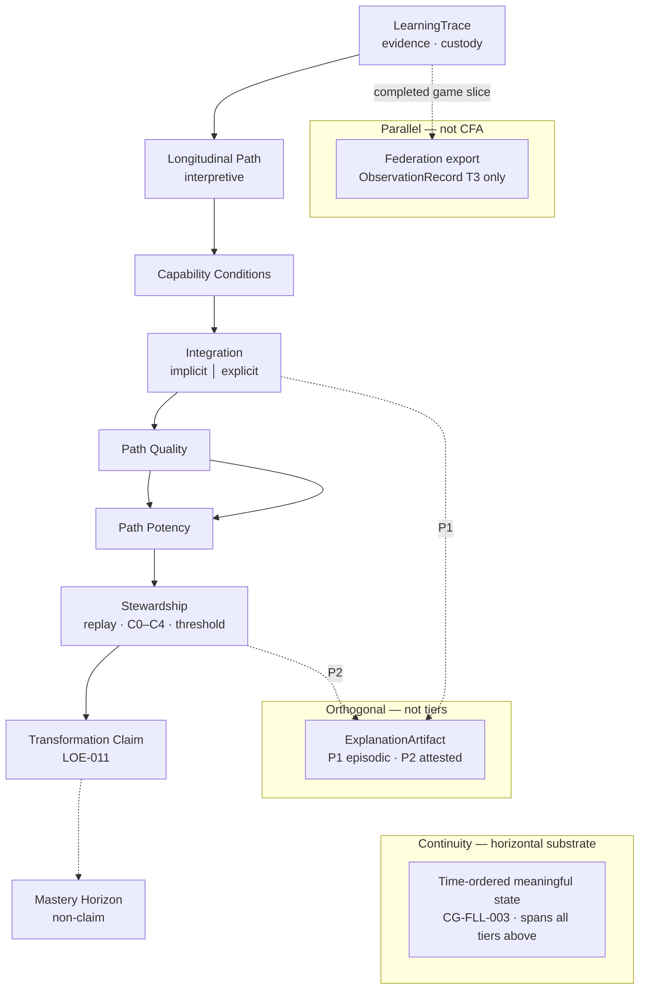

# CFA v1.0 — Capability Formation Architecture

| Field | Value |
|-------|-------|
| **Version** | 1.0 |
| **Status** | Canonical governance reference |
| **Source** | [LEF-2B — Canonical CFA Diagram and Terminology](studies/LEF-2B-canonical-cfa-diagram-and-terminology.md) |
| **Scope** | ChessGuide sovereign learning architecture |
| **Constraint** | Logical dependencies, not runtime pipeline |
| **Federation boundary** | Completed game `ObservationRecord` only ([FEDERATION.md](../../FEDERATION.md)) |

---

## Definition

Capability Formation Architecture explains how evidence, continuity, conditions, integration, stewardship and claims relate in the formation of durable capability over time.

---

## Core rule

```text
CFA expresses logical dependencies,
not a runtime pipeline.
```

Transformation **claims** require **explicit-channel** evidence or documented steward inference ([CG-FLL-001](../chessguide/CG-FLL-001-first-domain-learning-pilot.md), [LEF-0E](studies/LEF-0E-integration-theory.md)).

---

## Canonical diagram (ASCII)

```text
                    ┌─────────────────────────────────────┐
                    │     ExplanationArtifact (orthogonal) │
                    │  P1 episodic ←── Integration         │
                    │  P2 attested  ←── Stewardship        │
                    └─────────────────────────────────────┘
                                      ···
    LOGICAL DEPENDENCIES (not runtime pipeline)
    ═══════════════════════════════════════════

    ┌─────────────────┐
    │  LearningTrace  │  evidence · custody · trajectory
    └────────┬────────┘
             ▼
    ┌─────────────────┐
    │ Longitudinal    │  interpretive: recurrence · anchors
    │     Path        │  (alias: path formation + strength)
    └────────┬────────┘
             ▼
    ┌─────────────────┐
    │  Capability     │  modes · autonomy · attention policy
    │   Conditions    │
    └────────┬────────┘
             ▼
    ┌─────────────────┐
    │  Integration    │  implicit │ explicit
    │                 │  learning = integration achieved
    └────────┬────────┘
             ▼
    ┌─────────────────┐     ┌─────────────────┐
    │  Path Quality   │ ──► │  Path Potency   │
    └────────┬────────┘     └────────┬────────┘
             └──────────┬───────────┘
                        ▼
    ┌─────────────────┐
    │  Stewardship    │  replay · C0–C4 · threshold · gate
    └────────┬────────┘
             ▼
    ┌─────────────────┐
    │ Transformation  │  LOE-011 after C4
    │     Claim       │
    └────────┬────────┘
             │
             ▼  (non-claim horizon)
    ┌─────────────────┐
    │ Mastery Horizon │  long-horizon capability state
    └─────────────────┘

    ═══════════════════════════════════════════
    CONTINUITY (horizontal substrate — all tiers)
    time-ordered state · CG-FLL-003 · FCS-001 pattern

    ─ ─ ─ parallel (not CFA tier) ─ ─ ─
    Federation export: completed game ObservationRecord only
    (FEDERATION.md — sovereign learning retained)
```

---

## Canonical diagram (Mermaid)



**Reading notes:** Solid arrows = logical dependency. Dotted = orthogonal or parallel boundary. Mastery Horizon dashed from Claim = outcome horizon, not the next pipeline step.

---

## Narrative

Capability forms when **evidence** accumulates in a **LearningTrace**, is read as a **Longitudinal Path**, is enacted under **Capability Conditions**, and undergoes **Integration** (implicit uptake or explicit LOE/DOE-visible integration). Stewards assess **Path Quality** and **Path Potency** as distinct lenses. **Stewardship** replays lineage, applies C0–C4, evaluates threshold signals, and authorizes a **Transformation Claim** only after gate criteria. **Mastery Horizon** names sustained capability beyond a single claim. **Continuity** underlies every tier. **ExplanationArtifact** crosses Integration (P1) and Stewardship (P2) without occupying the ladder. Federation exports **completed-game continuity evidence** only; full CFA remains sovereign to ChessGuide.

---

## Canonical vocabulary (CFA Glossary v1.0)

| Term | Definition | Role in CFA | Depends on | Evidence |
|------|------------|-------------|------------|----------|
| **CFA** | Steward-facing model linking evidence → integration → governed claims | Meta-model | LEF line | LEF-2A |
| **LearningTrace** | Longitudinal container of sessions, episodes, events for one actor | Evidence substrate | — | **E1** CB-005 |
| **Longitudinal Path** | Interpretive pattern over trace: recurrence, anchors, trajectory shape | Read model on trace | LearningTrace | **E3** LEF-1B, 2A |
| **Capability Conditions** | Bundle of policies and states enabling enactment (modes, autonomy, attention) | Environment gate | LearningTrace (capture policy) | **E3** LEF-1E, CB-006 |
| **Integration** | Process by which observation becomes durable capability change | **Learning** (CG-FLL-002) | Trace + conditions | **E1** CG-FLL-002 |
| **Path Quality** | Normative assessment: is the path sound? | Assessment | Integration | **E3** LEF-1C |
| **Path Potency** | Yield assessment: does the path produce capability? | Assessment | Integration | **E3** LEF-1C |
| **Stewardship** | Custody, replay, checkpoints, threshold review, claim authorization | Governance gate | Quality, Potency, trace | **E1** CG-FLL-1E |
| **Transformation Claim** | Attested statement that transformation is supported (LOE-011 post-C4) | Governed outcome | Stewardship, lineage | **E1** CG-FLL-1E |
| **Mastery Horizon** | Long-horizon capability state; outside single-claim pipeline | Horizon label | Continuity, prior claims | **E3** LEF-1C, CB-000A H6 |
| **ExplanationArtifact** | Structured explanation bound to evidence refs | Orthogonal product | Integration, Stewardship | **E2** LEF-0C–0D |
| **Continuity** | Traceable time-ordered preservation and development of meaningful state | Horizontal substrate | LearningTrace pattern | **E2** CG-FLL-003, FCS-001 |
| **Implicit integration** | Compression, pattern uptake without full explicit LOE surface | Channel label | Integration | **E2** LEF-0E |
| **Explicit integration** | LOE/DOE-visible integration events | Channel label | Integration | **E1** LEF-1A, CG-FLL-1E |
| **Federation export slice** | T3 ObservationRecord for completed games only | Parallel boundary | LearningTrace subset | **E1** FEDERATION.md |

---

## Orthogonal layers

### Continuity

Horizontal substrate across all tiers — time-ordered meaningful state ([CG-FLL-003](../chessguide/CG-FLL-003-learning-continuity-semantics.md), [FCS-001](FCS-001-federation-continuity-study.md)). Not a vertical rung.

### ExplanationArtifact

Cross-cutting interpretive product:

- **P1** episodic — from **Integration**
- **P2** attested — from **Stewardship**

Not a ladder rung. See [LEF-0D](studies/LEF-0D-epistemic-placement-of-explanation-artifact.md).

### Federation export slice

Parallel boundary only:

- Completed game **ObservationRecord** (T3)
- **No** learning semantics, LOE/DOE, integration, or explanation export

See [FEDERATION.md](../../FEDERATION.md).

---

## Retired / non-canonical diagram terms

Not CFA v1.0 diagram rungs (valid in historical LEF studies only):

| Term | Notes |
|------|--------|
| **Flow** | LEF-1D |
| **Traversal Quality** | Describe via Capability Conditions + Integration |
| **Path Formation** | Alias → Longitudinal Path |
| **Path Strength** | Alias → Longitudinal Path |
| **Optimal Traversal** | LEF-1D |

**Inside Stewardship (not separate rungs):** Transformation Threshold, Replay, LearningExplanation (specialization of ExplanationArtifact).

---

## Stewardship internals

The **Stewardship** tier subsumes (see [CG-FLL-1E](../chessguide/CG-FLL-1E-first-domain-learning-pilot-execution-plan.md)):

| Component | Role |
|-----------|------|
| **Replay** | Lineage reconstruction (Part VII) |
| **C0–C4** | Stewardship checkpoints |
| **Threshold signals** | Pre-claim signals (e.g. IM-1) |
| **LOE-011 gate** | Transformation Claim only after C4 **supported** (or qualified) |

Do not add separate v1.0 rungs for these.

---

## Contributor onboarding

| Duration | Path |
|----------|------|
| **5 minutes** | ASCII diagram above + four bullets: evidence ≠ integration; claim needs stewardship; continuity is horizontal; federation ≠ learning export |
| **15 minutes (recommended)** | This document (diagram + glossary) + [CG-FLL-002](../chessguide/CG-FLL-002-learning-semantics.md) primary principle |
| **1 hour** | Above + skim [CG-FLL-001](../chessguide/CG-FLL-001-first-domain-learning-pilot.md) (I-3), [CG-FLL-1E](../chessguide/CG-FLL-1E-first-domain-learning-pilot-execution-plan.md) (C0–C4), [CB-005](../chessbuddy/CB-005-learningtrace-product-schema.md), [FEDERATION.md](../../FEDERATION.md) |

**Teaching sequence:** (1) CFA v1.0 diagram → (2) learning = integration achieved → (3) activity ≠ learning → (4) stewardship gate → (5) quality vs potency → (6) orthogonal layers → (7) federation boundary → (8) LEF studies as needed.

---

## Usage rules

| Use | Document |
|-----|----------|
| Canonical CFA diagram and glossary | **This file (`CFA-v1.0.md`)** |
| Research justification and canonicalization | [LEF-2B](studies/LEF-2B-canonical-cfa-diagram-and-terminology.md) |
| Adversarial synthesis | [LEF-2A](studies/LEF-2A-capability-formation-architecture.md) |
| LearningTrace product schema | [CB-005](../chessbuddy/CB-005-learningtrace-product-schema.md) |
| Learning governance details | CG-FLL-* |

**Do not:**

- Use CFA box names in runtime code before ADR
- Export CFA semantics over federation

---

## Related documents

| Document | Link |
|----------|------|
| LEF-2B | [studies/LEF-2B-canonical-cfa-diagram-and-terminology.md](studies/LEF-2B-canonical-cfa-diagram-and-terminology.md) |
| LEF-2A | [studies/LEF-2A-capability-formation-architecture.md](studies/LEF-2A-capability-formation-architecture.md) |
| CG-FLL-002 | [../chessguide/CG-FLL-002-learning-semantics.md](../chessguide/CG-FLL-002-learning-semantics.md) |
| CG-FLL-1E | [../chessguide/CG-FLL-1E-first-domain-learning-pilot-execution-plan.md](../chessguide/CG-FLL-1E-first-domain-learning-pilot-execution-plan.md) |
| CB-005 | [../chessbuddy/CB-005-learningtrace-product-schema.md](../chessbuddy/CB-005-learningtrace-product-schema.md) |
| FEDERATION.md | [../../FEDERATION.md](../../FEDERATION.md) |
