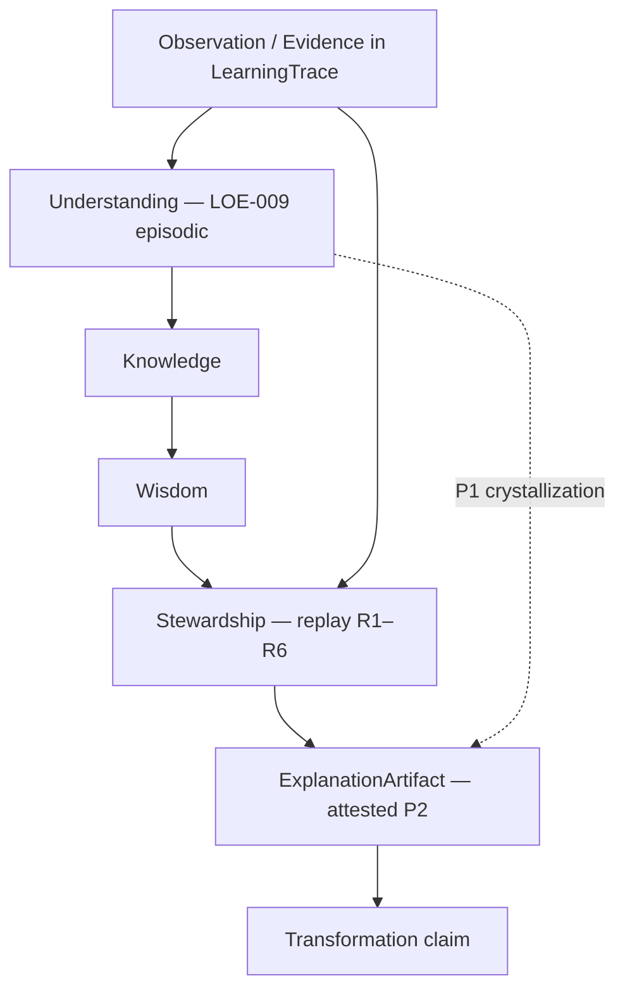

# LEF-0D — Epistemic Placement of ExplanationArtifact Report

## Repository-Grounded Epistemological Investigation (Governance Study)

| Field | Value |
|-------|-------|
| **Study ID** | LEF-0D |
| **Parent** | [LEF-0A](LEF-0A-architectural-interpretation-validation.md), [LEF-0B](LEF-0B-minimal-learning-explanation-experiment.md), [LEF-0C](LEF-0C-explanation-artifact-hypothesis.md) |
| **Date** | 2026-06-04 |
| **Status** | Complete (evidence only) |
| **Scope** | ChessGuide repository: `docs/governance/**`, `src/**`, `README.md`, `FEDERATION.md` |
| **Constraints** | No ontology, ADR, governance, federation, Creator, or runtime proposals |

---

## 1. Executive Summary

LEF-0D asks **where `ExplanationArtifact` belongs** in repository epistemology — not whether it exists (LEF-0C).

### Core question

Which candidate placement is **most strongly supported** by repository evidence?

### Study outcome

**Outcome A — A repository-supported placement is identified** (with **two evidence-backed profiles**, not a single serial slot).

| Profile | Placement | When |
|---------|-----------|------|
| **P1 — Episodic** | **Inside / at the Understanding stage** (Candidate **B**) | Learner or steward articulates *why* during or after episode interpretation (LOE-009, ChessReasoning, RC-*) |
| **P2 — Attested** | **Stewardship-bound bridge before Transformation claims** (Candidate **E**) | Durable, supersedeable “best why” for a phenomenon (especially transformation) after evidence + replay, before C4 / LOE-011 |

### Rejected as primary placement

| Candidate | Verdict |
|-----------|---------|
| **A** (strict serial: Understanding → Explanation → Knowledge → Wisdom) | **Weak** — chain is **dynamic**; experts compress Observation → Knowledge ([CG-FLL-002](../../chessguide/CG-FLL-002-learning-semantics.md)); no chain stage named “Explanation” between Understanding and Knowledge |
| **C** (Explanation before Understanding) | **Rejected** for durable artefact — observation/evidence and interpretation precede attested explanation; pedagogy may *teach* with “why” first ([CB-004](../../chessbuddy/CB-004-buddy-persona-and-product-principles.md)) but that is **instructional**, not `ExplanationArtifact` |
| **D** (fully independent parallel layer) | **Rejected as primary** — explanations are **always anchored** to trace, episode, or chain stage in governance; **partial** only as **non-sequential recurrence** (same episode, multiple stages) |

### One-line finding

Repository evidence places **explanation work** primarily in **Understanding**, and places **durable, steward-grade ExplanationArtifact** at the **Stewardship → Transformation** boundary — not as a new chain stage, but as the **persisted interpretive product** that satisfies “observed → explained → replayed → validated” ([CG-FLL-001](../../chessguide/CG-FLL-001-first-domain-learning-pilot.md)) without collapsing into LearningTrace (evidence) or Transformation (verdict).

---

## 2. Existing Epistemic Chains (Part 1)

### 2.1 Canonical federation learning chain

From [CB-000A](../../chessbuddy/CB-000A-longitudinal-learning-model.md) and [CG-FLL-002](../../chessguide/CG-FLL-002-learning-semantics.md):

```text
Reality → Observation → Attention → Understanding → Knowledge → Wisdom
  → Stewardship → Transformation
```

| Property | Evidence |
|----------|----------|
| **Accumulating artefacts** | Each stage “produces artefacts that constrain later stages” (CB-000A) |
| **Not strictly sequential** | CG-FLL-002: dynamic, recursive, simultaneous activation; novice more sequential, expert compressed paths |
| **Transformation gate** | Chain rule: Transformation claims require lineage through **Stewardship** back to **Observation** (CB-000A) |

### 2.2 FLL-1 pilot phase chain (operational mirror)

[CG-FLL-1E](../../chessguide/CG-FLL-1E-first-domain-learning-pilot-execution-plan.md) Part I:

| Phase | Chain stage | Explanation-related evidence |
|-------|-------------|------------------------------|
| 3 | Understanding | **“Concepts, explanations”**; LOE-009, DOE-006 |
| 4 | Knowledge | Recall (LOE-003/004) — no required explanation object |
| 5 | Wisdom | Judgment narratives |
| 6 | Stewardship | LOE-010; replay authority |
| 7 | Transformation | LOE-011 after steward review |

**Explanation appears explicitly in Phase 3 (Understanding), not as its own phase.**

### 2.3 ALP artifact-learning chain

[ALP-1](../../chessbuddy/ALP-1-artifact-learning-pilot.md) trace:

```text
Observation → Attention → ReasoningChains (Understanding)
  → Knowledge → Wisdom → Stewardship → TransformationRecords
```

| Deliverable | Stage | Explanatory role |
|-------------|-------|------------------|
| Understanding Report | Phase 3 | Phase synthesis |
| Transformation Report | Phase 7 | Post-stewardship synthesis |
| RC-1..4 | Understanding | Therefore-style inference |

### 2.4 Forensic / validation chains (cross-cutting)

| Chain | Source | Role of explanation |
|-------|--------|---------------------|
| `Observed → Replay → Investigation → Causal reconstruction → Explanation` | LEF-0A §6 | Explanation **after** reconstruction, **not** a chain stage name |
| `Observed → Explained → Replayed → Validated` | CG-FLL-001 success criteria | **Explained** is a **pilot success leg**, not a CB-000A stage |
| `Evidence → Replay → ExplanationArtifact → Transformation claim` | LEF-0C §6 | Bridge semantics for durable artefact |

### 2.5 Runtime chain

| Finding | Evidence |
|---------|----------|
| **Observation only** | `Game.toString()` / `GameHistory` — terminal game evidence ([`src/data/game.ts`](../../../src/data/game.ts)) |
| **No epistemic chain in code** | No Understanding/Knowledge/Wisdom persistence in `src/` |
| **Coaching excluded from federation** | CP/hints are sovereign, not epistemic placement ([`FEDERATION.md`](../../../FEDERATION.md)) |

### 2.6 Part 1 conclusion

Multiple **epistemic chains exist in governance**; **one** canonical chain (CB-000A). Explanation is **implicit** in Understanding and **procedural** at Stewardship/Transformation validation — **never** a named chain stage.

---

## 3. Explanation Dependencies (Part 2)

### 3.1 Can ExplanationArtifact exist without…?

| Dependency | Required? | Evidence |
|------------|-----------|----------|
| **Observation / evidence** | **Yes** | LEF-0B/C `evidence_refs[]`; CG-FLL-1E P5 evidence-before-claim; CB-000A chain rule |
| **Understanding / interpretation** | **Yes (de facto)** | LOE-009 is Understanding-stage; RC-* chains interpret OR-* observations; “Observation is reality interpreted through existing learning” (CG-FLL-002) — explanation presupposes **some** interpretive frame |
| **Replay** | **Conditional** | Not required for episodic LOE-009; **required** for transformation-grade attested explanation (CG-FLL-1E Part VII–VIII, LEF-0A replay ≠ explanation) |
| **Review / steward verdict** | **Conditional** | Learner explanation can exist without C4; **attested** best-why for transformation **follows** steward replay (C3/C4) |
| **Prior Learning (process)** | **Soft prerequisite** | CG-FLL-002: observation already learning-laden; does not require named Learning object |

### 3.2 Part 2 conclusion

**No durable ExplanationArtifact without observation/evidence.** Interpretation is **necessary**; steward replay/verdict is **necessary** for **P2 attested** profile only.

---

## 4. Knowledge Dependencies (Part 3)

### 4.1 Can Knowledge exist without Explanation?

| Test | Result |
|------|--------|
| Schema | CB-005 **Knowledge refs** (opening IDs) — no explanation field required |
| Events | LOE-003/004 recall — **no** mandated LOE-009 |
| Expert path | CG-FLL-002: Observation → Knowledge compression **without** conscious intermediate steps |
| Integration | CG-FLL-002 lists Explanation as **integration mechanism**, not prerequisite for all knowledge |

**Verdict: Yes — Knowledge can exist without ExplanationArtifact** in repository semantics.

### 4.2 Can knowledge be validated without explanatory structures?

| Test | Result |
|------|--------|
| CG-FLL-001 validation table | Knowledge/Wisdom: “Recall test, decision quality over episodes” — **not** explanation-required |
| Transformation validation | Requires chain linkage + steward sign-off; **“Explained”** in success criteria for **pilot holistically**, not per knowledge atom |

### 4.3 Part 3 conclusion

Knowledge **does not depend** on ExplanationArtifact. Explanation **feeds integration** (CG-FLL-002) and **strengthens** validation narratives but is **not** a gate for all knowledge consolidation.

---

## 5. Understanding Dependencies (Part 4)

### 5.1 Does understanding produce explanations, or the reverse?

| Direction | Evidence |
|-----------|----------|
| **Understanding → explanation** | LOE-009 at Understanding stage; CB-000A accumulates “reasoning artefacts”; ALP RC-* |
| **Explanation → understanding** | CB-004 pedagogy: Why (level 2) builds player understanding — **product UX**, not persisted artefact |
| **Both (recursive)** | CG-FLL-002 dynamic chain; same episode may record multiple stages |

### 5.2 Part 4 conclusion

Repository evidence **primarily supports: Understanding produces explanations** (episodic). Pedagogical “explain to understand” is **real in product principles** but **orthogonal** to P2 steward-grade artefact.

**Not Candidate C** for durable epistemic placement.

---

## 6. Learning Relationship (Part 5)

### 6.1 Is explanation prerequisite, consequence, evidence, or independent?

| Relation | Supported? | Evidence |
|--------|------------|----------|
| **Prerequisite to learning** | **Weak** | Exposure enables learning (H8); integration required for durability (H4) — explanation is **one** integration mechanism, not universal gate |
| **Consequence of learning** | **Partial** | Improved explanation (CG-FLL-1E Part VIII category) **follows** learning trajectory |
| **Evidence of learning** | **Partial** | LOE-009, “Explained” in CG-FLL-001 success — supports **claims**, does not **define** Learning (CG-FLL-002 integration process; LEF-0A) |
| **Independent** | **Partial** | Explanation-like events can be logged without Transformation; learning process continues |

### 6.2 Part 5 conclusion

Explanation is **neither prerequisite nor definition** of Learning. Closest fit: **consequence / integration mechanism** and **validation evidence** for learning **claims** — aligned with LEF-0B.

---

## 7. Transformation Relationship (Part 6)

### 7.1 Does transformation require explanation?

| Test | Result |
|------|--------|
| CB-005 Transformation **tags** | Can mark focus/milestone **without** causal narrative (LEF-0B) |
| CG-FLL-1E / CG-FLL-001 | Transformation **assessment** requires steward replay + articulation of *how* change occurred |
| LOE-011 | Created only after C4 **supported** — bundle implies **reviewed** causal account, not a named object today |

**Verdict: Transformation *claims* require explanatory procedure; Transformation *tags* do not require ExplanationArtifact.**

### 7.2 Does explanation require transformation?

| Test | Result |
|------|--------|
| LOE-009 / LOE-006 | Explain mistakes or ideas **without** transformation claim |
| ALP Understanding Report | Explains model learning **without** TR-* |

**Verdict: No — ExplanationArtifact can target non-transformation subjects** (LEF-0C subject_ref generalization). **LearningExplanation** specialization **does** reference transformation.

### 7.3 Part 6 conclusion

**Neither strictly entails the other.** **Coupling is strongest** for P2: attested explanation **precedes** LOE-011 / Transformation claim.

---

## 8. Wisdom Relationship (Part 7)

### 8.1 What distinguishes explanation from wisdom?

| Concept | CB-000A / CB-005 | Function |
|---------|------------------|----------|
| **Explanation** | Understanding stage; LOE-009; CB-004 “Why” | **Why** a phenomenon occurred |
| **Wisdom** | “What guided action”; wisdom refs = engine vs chosen delta | **Normative guidance** / judgment under uncertainty |

CB-004 hierarchy: What → **Why** → Pattern → **Action** → Evidence — **Why** (explanation) precedes **Action** (wisdom-like guidance) in **pedagogy**, not in CB-000A chain order (Wisdom stage before Stewardship).

### 8.2 Can wisdom exist without explanation? Can explanation exist without wisdom?

| Test | Result |
|------|--------|
| Wisdom without explanation | **Yes** — move choice, practice selection (LOE-007/008 narratives) may lack explicit causal write-up |
| Explanation without wisdom | **Yes** — diagnostic “why mistake happened” (LOE-006) without prescribing action |

### 8.3 Part 7 conclusion

Explanation and Wisdom are **distinct** in repository semantics. **Overlap** only in narrative prose, not in required structure.

---

## 9. Falsification Assessment (Part 8)

**Falsification target:** ExplanationArtifact has **no meaningful epistemic position** — only metadata, narrative, justification, or documentation.

| Collapse test | Result |
|---------------|--------|
| **Metadata** | **Partially sustained** for engine CP, tags — **not** ExplanationArtifact |
| **Narrative** | **Partially sustained** for R3–R5 replay prose — **fails** when supersession + falsifiers + evidence binding required (LEF-0B) |
| **Justification** | **Partially sustained** for C4 verdict / competence narrative — overlaps **judgment**, lacks `candidate_causes[]` structure |
| **Documentation** | ALP reports are documentation — **overlapping deliverable**, different lifecycle (LEF-0C) |

### 9.1 Meaningful position survives when:

1. Consumers need **addressable, supersedeable best-why** tied to `subject_ref`.  
2. Consumers must **separate evidence (trace) from interpretation (explanation)** (LEF-0A).  
3. Consumers must **audit** transformation claims (CG-FLL-001 replay + explain + validate).

### 9.2 Part 8 conclusion

ExplanationArtifact **is falsified** as a **universal layer above all prose**. It **survives** as a **named epistemic role** at **Understanding (episodic)** and **Stewardship→Transformation (attested)**.

---

## 10. Placement Analysis (Part 9)

### 10.1 Candidate A — Explanation after Understanding, before Knowledge

```text
Observation → Understanding → ExplanationArtifact → Knowledge → Wisdom
```

| For | Against |
|-----|---------|
| LOE-009 precedes recall consolidation in typical episode flow | **Not** a separate CB-000A stage |
| Explanation as integration feeds knowledge (CG-FLL-002) | Expert **skips** explicit middle |
| | Knowledge refs do not require explanation record |

**Score: Partial — describes episodic flow, not canonical stage insertion.**

### 10.2 Candidate B — Explanation as part of Understanding

```text
Understanding ├─ ExplanationArtifact
              └─ Knowledge (emergent)
```

| For | Against |
|-----|---------|
| CG-FLL-1E Phase 3 = “Concepts, **explanations**” | Does not locate **P2 attested** steward bundle |
| CB-000A: Understanding accumulates **reasoning artefacts** | Understanding stage name collides with artefact name (LEF-0C C-C1) |
| LOE-009 typed to Understanding | |

**Score: Strong for P1 episodic profile.**

### 10.3 Candidate C — Explanation before Understanding

```text
Observation → ExplanationArtifact → Understanding → …
```

| For | Against |
|-----|---------|
| Pedagogy: explain before dictate (CB-004) | Product teaching, not governance epistemics |
| | No evidence for durable artefact **before** interpretive work |
| | Contradicts evidence-before-claim |

**Score: Rejected for ExplanationArtifact (pedagogy only).**

### 10.4 Candidate D — Independent parallel layer

| For | Against |
|-----|---------|
| LEF-0C cross-cutting phrasing | Every explanation-like structure **maps** to a chain stage or steward procedure |
| Dynamic chain allows non-linear activation | **Not independent** of trace/evidence |

**Score: Rejected as primary; **partial** as **orthogonal axis** (durability × attestation), not parallel hierarchy.

### 10.5 Candidate E — Alternative placement (study selection)

**Stewardship-bound interpretive bridge:**

```text
… → Understanding (episodic explanation events)
… → Knowledge → Wisdom
… → Stewardship:
      evidence gate + replay (R1–R6)
      → ExplanationArtifact (attested, durable)
      → Transformation claim (LOE-011 / C4)
```

| For | Evidence |
|-----|----------|
| Matches chain rule terminus | Transformation requires Stewardship lineage |
| Matches FLL-1 procedure | Part VII replay → Part VIII C4 → LOE-011 |
| Matches LEF-0A forensic chain | Causal reconstruction → Explanation **after** replay |
| Separates verdict from model | C4 = judgment; ExplanationArtifact = **best why** (LEF-0B) |

**Score: Strongest for P2 attested profile.**

### 10.6 Synthesis diagram (evidence-based, not new ontology)



Solid arrows: canonical CB-000A order. Dotted: episodic explanation may be promoted to attested artefact under Stewardship.

### 10.7 Part 9 conclusion

**Most supported placement:**

| Profile | Winner |
|---------|--------|
| Episodic learner/steward explanation | **Candidate B** (within Understanding) |
| Durable supersedeable best-why (incl. LearningExplanation) | **Candidate E** (Stewardship → Transformation bridge) |

**Candidate A** is a **weakened serial shorthand** for P1 only. **Candidates C and D** are not primary.

---

## 11. Evidence Summary

| ID | Finding |
|----|---------|
| E-D1 | CB-000A defines **no** Explanation stage; Understanding holds reasoning artefacts |
| E-D2 | CG-FLL-1E Phase 3 explicitly includes **explanations** at Understanding |
| E-D3 | CG-FLL-002 chain is **dynamic** — strict serial A is incomplete |
| E-D4 | Transformation claims require **Stewardship** lineage (CB-000A) |
| E-D5 | FLL-1 procedure places **replay then C4 then LOE-011** — attested explanation before transformation record |
| E-D6 | Knowledge and Wisdom **can exist** without explanation objects |
| E-D7 | CG-FLL-001 requires **Explained** for pilot success — procedural, not schema stage |
| E-D8 | Runtime has **no** epistemic placement — governance-only today |
| E-D9 | Federation export **excludes** explanation — placement remains **sovereign-local** |

---

## 12. Contradictions

| ID | Contradiction | Resolution |
|----|---------------|------------|
| C-D1 | CG-FLL-001 lists **Explained** before **Replayed** in success wording vs CG-FLL-1E **replay before C4** | **Explained** = capability to articulate; **attested** artefact **after** replay for transformation — two senses of “explain” |
| C-D2 | CB-000A order Wisdom **before** Stewardship vs forensic chain explanation **under** stewardship | Nominal chain vs **validation workflow** — report both; P2 follows **workflow** |
| C-D3 | Understanding stage name vs ExplanationArtifact name | Stage = locus; artefact = **persisted best-why** with supersession |
| C-D4 | LEF-0C “cross-cutting layer” vs this study’s Stewardship bridge | Cross-cutting = **functional** role; placement = **Stewardship→Transformation** for P2 |

---

## 13. Open Questions

| ID | Question |
|----|----------|
| OQ-D1 | Should P1 episodic explanations be **promoted** to P2 automatically on C4, or remain separate? |
| OQ-D2 | Does `subject_kind` determine profile (episodic vs attested) or do two artefact types exist? |
| OQ-D3 | Where does **Review** (outcome-scoped) sit relative to P2 — sibling of ExplanationArtifact or subtype? |
| OQ-D4 | How does CTP “interpretation step” align with P2 when federation matures (out of scope here)? |

---

## 14. Conclusion

### 14.1 Success criteria

| Outcome | Selected? |
|---------|-----------|
| **A — Repository-supported placement identified** | **Yes** |
| **B — Multiple plausible placements remain** | **Partially** — two **profiles**, not arbitrary pluralism |
| **C — Insufficient evidence** | **No** for governance; **Yes** for runtime encoding |

### 14.2 Placement verdict (answers core question)

```text
ExplanationArtifact (episodic)     →  Understanding stage (Candidate B)
ExplanationArtifact (attested)     →  Stewardship output feeding Transformation (Candidate E)
LearningExplanation                  →  P2 attested profile with subject = transformation
```

**Not** a new chain stage between Understanding and Knowledge. **Not** before Understanding. **Not** a fully independent epistemic plane.

### 14.3 Relation to prior LEF studies

| Study | Carried forward |
|-------|-----------------|
| LEF-0A | Trace = evidence; Replay = reconstruction; Explanation ≠ trace |
| LEF-0B | LearningExplanation = durable best-why for transformation |
| LEF-0C | ExplanationArtifact genus; LearningExplanation specialization |
| **LEF-0D** | **Where** genus/species sit in chain: **Understanding (P1) + Stewardship bridge (P2)** |

### 14.4 Governance rule compliance

| Rule | Status |
|------|--------|
| Epistemological study only | ✓ |
| No ontology / ADR / implementation / federation / Creator | ✓ |
| Repository evidence over elegance | ✓ |

---

## Related

- [LEF-0A](LEF-0A-architectural-interpretation-validation.md)
- [LEF-0B](LEF-0B-minimal-learning-explanation-experiment.md)
- [LEF-0C](LEF-0C-explanation-artifact-hypothesis.md)
- [CB-000A — Longitudinal Learning Model](../../chessbuddy/CB-000A-longitudinal-learning-model.md)
- [CG-FLL-002 — Learning Semantics](../../chessguide/CG-FLL-002-learning-semantics.md)
- [CG-FLL-1E — FLL-1 Execution Plan](../../chessguide/CG-FLL-1E-first-domain-learning-pilot-execution-plan.md)
