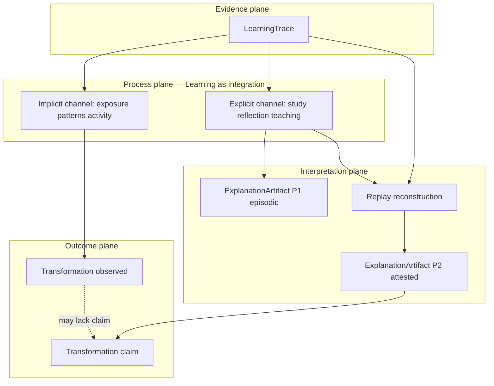

# LEF-0E — Integration Theory

## Interpretive Integration Study (Governance Research)

| Field | Value |
|-------|-------|
| **Study ID** | LEF-0E |
| **Parent** | [LEF-0A](LEF-0A-architectural-interpretation-validation.md) through [LEF-0D](LEF-0D-epistemic-placement-of-explanation-artifact.md) |
| **Date** | 2026-06-04 |
| **Status** | Complete (interpretive synthesis) |
| **Scope** | ChessGuide repository evidence synthesized from LEF-0A–0D and governing docs |
| **Constraints** | No ADR, governance edits, ontology, runtime, federation, or Creator proposals |

---

## 1. Executive Summary

LEF-0E **synthesizes** LEF-0A through LEF-0D into one **Integration Theory** — an interpretive model, not a new ontology.

### Pattern confirmed across LEF studies

```text
Learning              ≠  ExplanationArtifact
Transformation        ≠  Learning
LearningTrace           ≠  ExplanationArtifact
Implicit integration    ≠  Explicit integration   (interpretive labels — see §5–6)
```

### Core answer

The most coherent model supported by repository evidence:

> **Learning is integration** — a process that may proceed **implicitly** (exposure, pattern uptake, compressed expertise paths) or **explicitly** (articulated, replayed, steward-attested).  
> **Transformation** is **observable capacity change** — sometimes visible without preserved explanation.  
> **ExplanationArtifact** is the **inspectable record of why** when integration or transformation must be **audited, superseded, or federated-adjacent** — not learning itself.  
> **LearningTrace** is **evidence and custody** — the substrate both integration paths consume.

### Integration Theory (one paragraph)

Capability changes through **longitudinal episodes**. **Implicit integration** accumulates from activity, exposure, and pattern recognition without requiring durable explanation (CG-FLL-002 H8, expert compression). **Explicit integration** binds change to **inspectable mechanisms** — study, teaching, reflection, stewardship, replay, and when required **ExplanationArtifact** (P1 episodic at Understanding, P2 attested at Stewardship→Transformation per LEF-0D). **Transformation claims** in governance require **explicit integration evidence** (chain lineage, replay, C4); **Transformation signals** may appear without it. Federation transports **continuity** (completed games); domains retain **learning, integration, and explanation**.

### Deliverable success

| Criterion | Met? |
|-----------|------|
| Coherent synthesis of LEF-0A–0D | Yes |
| Repository-grounded implicit / explicit integration | Yes (interpretive; terms not in repo verbatim) |
| Candidate Integration Theory | Yes (§11) |
| Open questions for LEF-1 | Yes (§12) |

---

## 2. Learning Revisited (Part 1)

### 2.1 What Learning means in repository evidence

| Source | Definition |
|--------|------------|
| **CG-FLL-002** | “Learning is **integration achieved**” — not information received |
| **CB-000A** | Learning is a **trajectory**, not an event |
| **LEF-0A** | Learning ≠ Transformation; Learning ≠ explanation-as-noun |
| **LEF-0B** | Learning is **integration process**; explanation is **model of why** change was observed |

### 2.2 Necessary for Learning (governance)

| Necessary | Evidence |
|-----------|----------|
| **More than activity** | CG-FLL-002: activity alone insufficient |
| **Integration (some form)** | Primary principle; mechanisms include reflection, explanation, simulation, teaching (CG-FLL-002) |
| **Transformation as evidence signal** | CG-FLL-002: “Learning requires transformation” for **recognition**; H5: observable through transformation not activity |
| **Longitudinal span (for durable claims)** | CB-000A; CG-FLL-001 multiple episodes |

### 2.3 Unnecessary for Learning

| Unnecessary | Evidence |
|-------------|----------|
| **ExplanationArtifact** | LOE-009 optional per episode; knowledge without LOE-009 (LEF-0D) |
| **Explicit awareness** | Expert paths compress Observation → Knowledge (CG-FLL-002); implicit pattern uptake (LOE-002) |
| **Named Learning object in runtime** | No implementation in `src/` |
| **Federation export of learning semantics** | FEDERATION.md / FCI-5c: evidence only |

### 2.4 Can Learning occur without ExplanationArtifact? Without explicit awareness?

| Question | Verdict |
|----------|---------|
| Without ExplanationArtifact | **Yes** — integration mechanisms include simulation, comparison, application without durable “best why” object |
| Without explicit awareness | **Yes (partial)** — repository allows capability change and pattern recognition without learner articulation; **durable attested learning claims** require explicit steward-visible evidence (CG-FLL-001) |

### 2.5 Part 1 conclusion

**Learning** = **integration process over time** that may remain **implicit** until introspection, stewardship, or pilot procedure makes it **explicit**.

---

## 3. Transformation Revisited (Part 2)

### 3.1 What transforms?

| Evidence | Answer |
|----------|--------|
| CB-000A | **Capability** / skill (`SkillTransformation`) |
| CG-FLL-002 | **Future capability** — observation capacity, judgment, transfer |
| CB-005 | **Transformation tags** on episodes — focus, milestone |
| ALP TR-* | Reasoning and product **behaviour** (artifact domain) |

### 3.2 How is transformation observed?

| Mode | Evidence |
|------|----------|
| **Measured proxies** | IM-1 Measured vs Perceived; engine deltas (CB-005) |
| **Perceived narrative** | Learner draft + reflection (CG-FLL-1E Part VIII) |
| **Steward verdict** | C4 supported / qualified / not supported |
| **Trace lineage** | Chain rule: Observation → … → Stewardship → Transformation claim |

### 3.3 Relationships

| Pair | Relationship |
|------|--------------|
| **Transformation ↔ Learning** | Learning **evidenced through** transformation signals (H5); learning **is not** transformation (LEF-0A, CG-FLL-002) |
| **Transformation ↔ ExplanationArtifact** | **Claims** require explanatory **procedure**; **tags** do not require artefact (LEF-0D). **LearningExplanation** explains **why** a transformation is believed |

### 3.4 Part 2 conclusion

**Transformation** = **observable change** (especially capacity). **Transformation claim** = **governed assertion** requiring explicit integration trail — distinct from raw change.

---

## 4. Explanation Revisited (Part 3)

### 4.1 Path: LearningExplanation → ExplanationArtifact

| Step | Study | Finding |
|------|-------|---------|
| 1 | LEF-0A | Explanation distributed in Understanding / steward — not in LearningTrace |
| 2 | LEF-0B | Gap: no durable supersedeable “best causal why” for transformation |
| 3 | LEF-0C | Same field shape appears for multiple phenomena → **genus** `ExplanationArtifact` |
| 4 | LEF-0D | Genus has **two placements**: P1 Understanding, P2 Stewardship→Transformation |

### 4.2 Evidence that supported the transition

| Evidence | Role |
|----------|------|
| LOE-009, LOE-006, C4, ALP reports | Multiple subjects, one skeleton |
| LEF-0B falsification | Neither Review, Replay, nor Transformation **subsumes** durable best-why |
| CG-FLL-1E procedure | Causal narrative required in **process**, not **schema** |

### 4.3 Contradictions carried forward

| ID | Issue |
|----|-------|
| X-1 | “Explanation” as chain stage name vs artefact name |
| X-2 | ALP report titles vs domain causal record |
| X-3 | Pedagogical explain (CB-004) vs epistemic artefact |

### 4.4 Unresolved

- CB-005 schema promotion vs pilot sidecar (LEF-0B OQ-B4)  
- Whether all P1 episodic explanations promote to P2 on C4 (LEF-0D OQ-D1)  
- Cross-domain Review vs ExplanationArtifact (Fintech cited in LEF-0B only in study text)

### 4.5 Part 3 conclusion

**LearningExplanation** is the **FLL-1 transformation-bound specialization** of **ExplanationArtifact** — not a separate discovery.

---

## 5. Implicit Integration (Part 4)

### 5.1 Term status

**`Implicit Integration` does not appear verbatim** in repository documents. LEF-0E introduces it as an **interpretive label** for evidence-compatible patterns.

### 5.2 Repository-compatible definition

```text
Implicit Integration =
  capability change or learning-bearing uptake
  without a required, durable, inspectable ExplanationArtifact
```

### 5.3 Supporting evidence

| Pattern | Source |
|---------|--------|
| Activity without learning | CG-FLL-002 |
| Exposure enables learning; integration makes durable (H8) | CG-FLL-002 |
| Recall without integration | CG-FLL-002 recall path |
| Expert compression Observation → Knowledge | CG-FLL-002 |
| Pattern recognition LOE-002 | CG-FLL-1E |
| Repeated engagement H6 | CG-FLL-002 |
| Transformation tags without causal narrative | LEF-0B, CB-005 |
| Game play → skill uptake (runtime) | `GameHistory` stores episodes only — no explanation |

### 5.4 Challenging evidence

| Challenge | Source |
|-----------|--------|
| H4: integration required for **durable** learning | CG-FLL-002 — implicit alone may be **insufficient for durable claims** |
| Pilot success requires **Explained** | CG-FLL-001 — governance **values** explicit account for validated transformation |
| IM-1 gap detection | CB-000A — implicit perceived change may **diverge** from measured |

### 5.5 Part 4 conclusion

**Implicit integration is repository-compatible** as **interpretive vocabulary** for uptake without preserved explanation. It is **not** sufficient alone for **steward-attested transformation claims**.

---

## 6. Explicit Integration (Part 5)

### 6.1 Term status

**`Explicit Integration` does not appear verbatim** in repository documents. Introduced here as interpretive label.

### 6.2 Repository-compatible definition

```text
Explicit Integration =
  capability change supported by
  explainable, inspectable, reconstructable evidence
  (including but not limited to ExplanationArtifact when durability is required)
```

### 6.3 Supporting evidence

| Mechanism | Source |
|-----------|--------|
| Integration mechanisms list (reflection, explanation, teaching, …) | CG-FLL-002 |
| LOE-009, DOE-006, LOE-010 | CG-FLL-1E |
| Steward checkpoints C0–C4 | CG-FLL-1E Part VI |
| Replay R1–R6 | CG-FLL-1E Part VII |
| Observed → Explained → Replayed → Validated | CG-FLL-001 |
| Recognition criteria: traceable chain | CG-FLL-002 |
| ALP replay test | ALP-1 |
| ExplanationArtifact P1/P2 | LEF-0D |

### 6.4 Challenging evidence

| Challenge | Source |
|-----------|--------|
| No runtime operationalization | `src/` |
| Tool-agnostic pilot (markdown logs) | CG-FLL-1E Part IX |
| Expert may integrate explicitly **internally** without log | CG-FLL-002 compression |

### 6.5 Part 5 conclusion

**Explicit integration is repository-compatible** and **aligned with FLL-1 and steward governance**. It is **what pilots require** for validated transformation — not necessarily what all learning requires.

---

## 7. Relationship Between Implicit and Explicit Integration (Part 6)

### 7.1 Model evaluation

| Model | Verdict |
|-------|---------|
| **A — Independent** | **Weak** — same episodes feed both; IM-1 links perceived (often implicit) to measured (explicit) |
| **B — Explicit specialization of Implicit** | **Partial** — explicit path **adds** audit requirements when claims are made; not all explicit integration requires prior implicit |
| **C — Implicit → Introspection → ExplanationArtifact → Explicit** | **Partial** — matches **promotion** path for high-stakes claims; too linear for CG-FLL-002 dynamic chain |
| **D — Dual-channel longitudinal model** | **Strongest** — see §11 |

### 7.2 Synthesis (Model D preview)

```text
Longitudinal episodes produce evidence (LearningTrace)
        ├─ Implicit channel: exposure, pattern uptake, skill drift
        └─ Explicit channel: articulation, replay, stewardship, ExplanationArtifact
                    ↓
        Transformation (observed)  vs  Transformation claim (attested)
```

**Introspection (IM-1)** compares channels — does not replace either.

### 7.3 Part 6 conclusion

**Neither independent nor strict hierarchy.** **Explicit integration is the auditable specialization** demanded when governance requires **validation** — not a replacement for all learning.

---

## 8. ExplanationArtifact in the Integration Model (Part 7)

| Question | Answer |
|----------|--------|
| **Role** | **Inspectable “best why”** binding evidence to a **subject** — promotes implicit uptake to **auditable** account |
| **Required for Learning?** | **No** |
| **Required for Transformation?** | **No** for signals/tags; **Yes (procedural)** for **attested claims** in FLL-1 |
| **Required for Stewardship?** | **Conditional** — replay can proceed without artefact; **C4-quality** claims need causal account (artefact or equivalent prose) |
| **Only for explicit integration?** | **Yes** — when durability, supersession, falsifiers matter (LEF-0C falsification survival) |

**LearningTrace** supplies `evidence_refs`; **Replay** supplies `reconstruction_summary`; **ExplanationArtifact** supplies **why** — three non-collapsible roles (LEF-0A).

---

## 9. Learning vs Explanation (Part 8)

### 9.1 Why distinct

| Dimension | Learning | ExplanationArtifact |
|-----------|----------|---------------------|
| **Nature** | Process (integration) | Product (interpretive record) |
| **Time** | Trajectory | Snapshot / versioned “current best” |
| **Federation** | Sovereign, not exported | Sovereign, not exported |
| **Canon** | CG-FLL-002 integration | LEF-0B/C genus |

### 9.2 Overlap

- Explanation listed as **integration mechanism** (CG-FLL-002)  
- LOE-009 logged as learning-bearing event  
- Successful pilot requires learner/steward to **explain how** change occurred  

### 9.3 Divergence

- Learning can complete **without** durable explanation object  
- ExplanationArtifact can target **non-learning subjects** (e.g. error recognition LOE-006)  
- **Verb** “explain” (ALP, Buddy) ≠ **noun** Learning (LEF-0A C-5)

---

## 10. Transformation vs Explanation (Part 9)

### 10.1 Why distinct

| Dimension | Transformation | ExplanationArtifact |
|-----------|----------------|---------------------|
| **Nature** | Capacity delta / verdict | Causal model |
| **Schema** | Tags, LOE-011 gate | Not in CB-005 today |
| **Steward output** | C4 judgment | Best-why with falsifiers |

### 10.2 Overlap

- Transformation **review** produces explanatory prose  
- **LearningExplanation** subject = transformation  
- ALP “Transformation Report” synthesizes change narrative  

### 10.3 Divergence

- Transformation **without** explanation (tags, measured drift)  
- Explanation **without** transformation claim (mistake, phase report)  
- Verdict **supported** ≠ causal model **complete**

---

## 11. Integration Theory (Part 10)

### 11.1 Formal statement (candidate — interpretive, not ontology)

**Integration Theory (ChessGuide evidence synthesis):**

1. **Evidence plane:** `LearningTrace` = time-ordered custody of learning-bearing observations.  
2. **Process plane:** `Learning` = integration across episodes (implicit and/or explicit channels).  
3. **Interpretation plane:** `ExplanationArtifact` = optional but governance-critical **persisted best-why** (P1 episodic, P2 attested).  
4. **Reconstruction plane:** `Replay` = mechanism to rebuild narrative from evidence — not explanation.  
5. **Outcome plane:** `Transformation` = observable capacity change; **claims** require explicit integration + stewardship lineage.  
6. **Federation plane:** transports **continuity** (e.g. completed games); **does not** transport learning, integration, or explanation (FEDERATION.md).

### 11.2 Unified flow



### 11.3 LEF sequence closure

| Study | Contribution to theory |
|-------|------------------------|
| LEF-0A | Separated trace, replay, explanation, learning, transformation |
| LEF-0B | Named gap → LearningExplanation |
| LEF-0C | Generalized → ExplanationArtifact |
| LEF-0D | Placed artefact epistemically (P1, P2) |
| **LEF-0E** | **Integrated via implicit / explicit integration channels** |

### 11.4 Part 10 conclusion

One connected system: **evidence accumulates → integration operates (implicit and explicit) → explanation crystallizes when audit demands → transformation is observed and sometimes claimed under stewardship.**

---

## 12. Open Questions (Part 11 — for LEF-1)

| ID | Question |
|----|----------|
| OQ-E1 | Can **ExplanationArtifact** emerge **retroactively** from implicit integration (steward inference only)? |
| OQ-E2 | Can **explicit integration** be **operationalized** in runtime without collapsing into coaching export? |
| OQ-E3 | Should **IntegrationEvidence** exist as a named bundle (trace refs + integration channel tag)? |
| OQ-E4 | Should **IntegrationAssessment** parallel DCF LearningAssessment for chess domain? |
| OQ-E5 | Minimum episode count before implicit drift counts as transformation signal? |
| OQ-E6 | Does P1 auto-promote to P2 on C4, or remain separate records? |
| OQ-E7 | How does **integration window** (CG-FLL-1E Part IX) affect implicit vs explicit attribution? |
| OQ-E8 | Can federation ever reference **existence** of explanation without exporting content? |

---

## 13. Evidence Summary

| ID | Finding |
|----|---------|
| E-E1 | CG-FLL-002: Learning = integration achieved |
| E-E2 | LEF-0A–0D: four non-collapsible distinctions confirmed |
| E-E3 | Implicit / explicit labels **interpretive** but **evidence-backed** |
| E-E4 | Transformation claims require stewardship + explicit trail; signals may not |
| E-E5 | ExplanationArtifact required only for **auditable explicit** integration |
| E-E6 | Runtime implements **evidence only**; theory is governance-forward |
| E-E7 | Federation sovereignty preserves learning/integration/explanation locally |

---

## 14. Contradictions

| ID | Contradiction | Hold |
|----|---------------|------|
| C-E1 | “Learning requires transformation” vs transformation without articulated learning | **Hold** — recognition vs mechanism |
| C-E2 | Expert implicit path vs pilot explicit requirements | **Hold** — different stakes |
| C-E3 | Integration as process vs Explanation as mechanism | **Resolved** — mechanism ⊂ process |
| C-E4 | CG-FLL-001 explain/replay order vs CG-FLL-1E procedure | **Hold** — capability vs artefact timing (LEF-0D C-D1) |

---

## 15. Conclusion

LEF-0E provides a **repository-grounded Integration Theory** that unifies LEF-0A–0D without new ontology:

- **Learning** integrates.  
- **Transformation** manifests change; **claims** gate on explicit integration.  
- **ExplanationArtifact** documents **why** when inspectability is required — **not** learning itself.  
- **Implicit** and **explicit** integration are **two channels** on the same longitudinal evidence, converging at stewardship when validation is required.

**Prescriptive implementations are out of scope.** LEF-1 studies should test OQ-E1–E8 against pilot execution.

### Governance compliance

| Rule | Status |
|------|--------|
| Interpretive synthesis only | ✓ |
| No ADR / governance / runtime / federation / Creator | ✓ |
| Evidence over elegance | ✓ |

---

## Related

- [LEF-0A](LEF-0A-architectural-interpretation-validation.md)
- [LEF-0B](LEF-0B-minimal-learning-explanation-experiment.md)
- [LEF-0C](LEF-0C-explanation-artifact-hypothesis.md)
- [LEF-0D](LEF-0D-epistemic-placement-of-explanation-artifact.md)
- [CG-FLL-002 — Learning Semantics](../../chessguide/CG-FLL-002-learning-semantics.md)
- [CB-000A — Longitudinal Learning Model](../../chessbuddy/CB-000A-longitudinal-learning-model.md)
