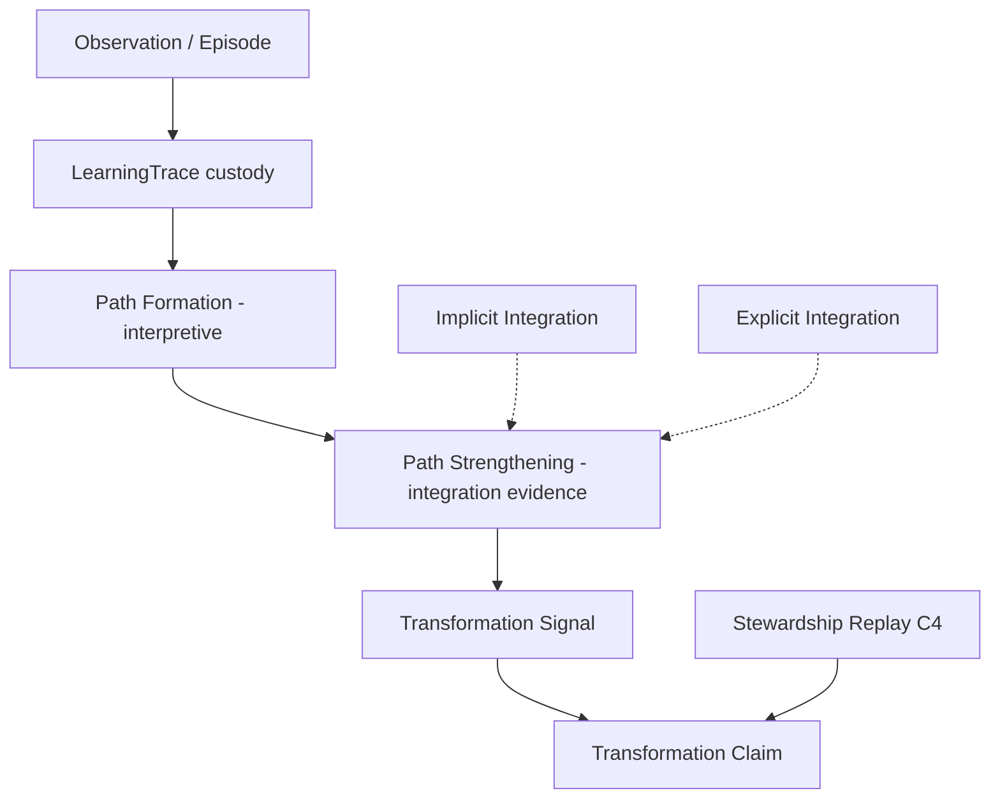

# LEF-1B — LearningTrace as Path Formation Hypothesis

## Governance Research Study (Hypothesis Validation)

| Field | Value |
|-------|-------|
| **Study ID** | LEF-1B |
| **Parent** | [LEF-0A](LEF-0A-architectural-interpretation-validation.md)–[LEF-0E](LEF-0E-integration-theory.md), [LEF-1A](LEF-1A-operationalizing-explicit-integration.md) |
| **Date** | 2026-06-04 |
| **Status** | Complete (evidence only) |
| **Scope** | ChessGuide repository: `docs/governance/**`, `src/**`, LEF series |
| **Constraints** | No ADR, governance edits, runtime, federation, or Creator proposals |

---

## 1. Executive Summary

LEF-1B tests whether **LearningTrace** can be interpreted as **path formation through continuity** — not only as history, evidence, and custody.

### Core answer

| Question | Verdict |
|----------|---------|
| Is LearningTrace **only** historical evidence? | **No** — also **trajectory container**, **custody**, **reconstruction substrate** (LEF-0A) |
| Can it represent **path formation**? | **Yes (interpretive)** — supported by continuity semantics, cross-episode anchors, and longitudinal integration theory |
| Does path formation **contribute to** Transformation? | **Partially** — **supports** signals and **evidence for claims**; does **not alone produce** attested Transformation |
| Is **Path Strength** useful? | **Yes (interpretive)** — mappable to LOE/Part IV indicators; not a repo-native term |

### Hypothesis status

```text
LearningTrace  =  evidence + custody + trajectory  (repository-primary)
              +  path-formation record  (interpretive extension, not replacement)
```

**Path analogy:** Repeated **episode traversal** (games, study blocks) leaves a **trace**; **integration** (implicit/explicit) **strengthens** traversable patterns; **capability** (terrain) may change — that change is **Transformation**, not a mutation of the trace file.

### One-line finding

The repository already treats LearningTrace as **longitudinal progression** (CB-000A, CG-FLL-003). **Path formation** is a **coherent interpretive layer** on that progression — **compatible** with evidence, **not contradicted** as metaphor — but **Transformation still requires** integration + stewardship, not trace volume alone.

---

## 2. LearningTrace Revisited (Part 1)

### 2.1 What LearningTrace is (repository evidence)

| Source | Definition |
|--------|------------|
| **CB-005** | “**Longitudinal container**” for one Actor; Actor → LearningTrace → Session → Episode → Event |
| **CB-000A** | Time-ordered, anchorable record; episodic data points aggregate to **trend/transformation** |
| **CG-FLL-1E** | Pilot mapping: all episodes for Actor; LOE/DOE at Event level |
| **LEF-0A** | **Combination:** history + trajectory + evidence substrate + custody; **not** explanation container |

### 2.2 What LearningTrace is not

| Not | Evidence |
|-----|----------|
| **Learning (process)** | CG-FLL-002; LEF-0E — integration occurs **on** trace, not **as** trace |
| **Explanation** | LEF-0A, LEF-0D — Understanding / steward artefacts |
| **Transformation (verdict)** | LOE-011 gate; C4 after steward review |
| **Federation export of learning** | FEDERATION.md — completed game continuity only at T3 boundary |
| **Guaranteed learning** | CG-FLL-001 I-3: activity in trace ≠ learning without LOE linkage |

### 2.3 Legacy runtime partial fit

| Runtime | Governance intent |
|---------|-------------------|
| `GameHistory` / `localStorage` `log` | Episode strings only — **path-like chronology** without LOE/DOE ([`src/data/game.ts`](../../../src/data/game.ts)) |
| FGI-001 | Full CB-005 schema **planned**; legacy = **incomplete** path record |

### 2.4 Part 1 conclusion

Current interpretation (**LEF-0A**) remains **valid**. Path-formation hypothesis **extends** rather than **replaces** it.

---

## 3. Candidate Interpretations (Part 2)

### 3.1 Model A — Historical Record

| Verdict | **Partially supported** |
|---------|-------------------------|
| **For** | Stewardship read/export; sorted game lines; ALP replay from recorded phases |
| **Against as sole model** | CB-000A requires **lineage** for claims; history alone fails I-3 |

### 3.2 Model B — Evidence Artifact

| Verdict | **Strongly supported** |
|---------|-------------------------|
| **For** | Observation stream, anchors, signals; replay substrate; chain rule (CB-000A, CB-005) |
| **Role** | Primary **repository** characterization |

### 3.3 Model C — Path Formation

| Verdict | **Supported as interpretive hypothesis** |
|---------|------------------------------------------|
| **For** | CG-FLL-003: continuity = **cumulative developmental process**; H9 “Transformation is continuity made visible”; AN-4 cross-episode pattern queries; CB-000A episodic → trend diagram |
| **Limit** | No document names “path formation”; metaphor not schema field |

### 3.4 Model D — Trajectory + Integration Substrate (synthesis)

```text
LearningTrace =
  longitudinal evidence record (B)
  + custody container
  + trajectory index for integration paths (C interpretive)
```

**Recommended composite:** **B + D** (B operational, C explanatory).

### 3.5 Part 2 conclusion

LearningTrace is **not merely** Model A. **Model B is primary.** **Model C is a valid interpretive reading** of longitudinal + continuity docs.

---

## 4. Path Formation Analogy (Part 3)

### 4.1 Proposed analogy chain

```text
Observation
  ↓
Repeated Traversal (episodes, sessions, LOE-bearing events)
  ↓
Path Formation (trace accumulates linked episodes + anchors)
  ↓
Path Strengthening (integration deepens: implicit + explicit)
  ↓
Terrain Change (capability / observation capacity)  ← Transformation domain
```

### 4.2 Repository compatibility

| Analogy step | Repository concept |
|--------------|-------------------|
| Observation | Chain stage; LOE-001; episode terminal |
| Repeated traversal | Multiple episodes in LearningTrace; H6 continuity; CG-FLL-001 return frequency |
| Path formation | Trace growth + AN-4 cross-episode anchors; “cumulative development” (CG-FLL-003) |
| Path strengthening | H2 continuity increases integration; LOE-004; expert compression (CG-FLL-003) |
| Terrain change | SkillTransformation; LOE-011; transformation tags — **capacity**, not log bytes |

### 4.3 Contradictions to analogy

| Risk | Mitigation in repo |
|------|-------------------|
| Trace **is** the terrain | **Rejected** — transformation is **capability**, trace is **record** (LEF-0A) |
| More games = deeper path | **Rejected** — I-3, LEF-1A: volume ≠ integration |
| Path = explanation | **Rejected** — LEF-0A |

### 4.4 Part 3 conclusion

Analogy is **compatible** if **terrain change = Transformation (capability)** and **trace = record of traversals**, not the ground itself.

---

## 5. Continuity and Path Formation (Part 4)

### 5.1 Can path formation exist without continuity?

| Verdict | **Weak path** |
|---------|---------------|
| Evidence | Single episode + anchors = minimal path segment; CG-FLL-003: continuity is **sustained progression** — durable path formation **implies** continuity over multiple episodes |

### 5.2 Can continuity exist without path formation?

| Verdict | **Yes (degenerate case)** |
|---------|---------------------------|
| Evidence | Activity without LOE linkage = continuity of **sessions** without **learning-bearing path** (random practice, CG-FLL-003) |

### 5.3 Relationship

```text
Continuity (sustained engagement + progression)
  enables
Path formation (linked episode/event sequence with anchors)
  enables
Path strengthening (integration along that sequence)
```

CG-FLL-003: “Longitudinal learning is integration **through** continuity.”

### 5.4 Part 4 conclusion

**Path formation without continuity** is **episodically thin**. **Continuity without integration events** is **activity-only** — not a learning path in governance terms.

---

## 6. LearningTrace and Integration (Part 5)

### 6.1 Implicit Integration

| Relation | Evidence |
|----------|----------|
| Trace **records** traversals | Episodes, moves, pattern LOE-002 without mandatory narrative |
| Trace **does not prove** implicit integration | Requires inference from LOE or measured drift (IM-1) |
| Path **widens** with repeated exposure | H8 exposure enables; H4 integration for durability |

**LearningTrace is necessary substrate; implicit integration is inferred process.**

### 6.2 Explicit Integration

| Relation | Evidence |
|----------|----------|
| Trace **hosts** LOE/DOE | CG-FLL-1E hierarchy |
| Explicit integration **annotates** path | Event IDs, dialogue, anchors — LEF-1A bundles |
| Replay **walks** path | CG-FLL-1E Part VII — reconstruct journey from trace |

### 6.3 Dual-channel (LEF-0E)

```text
LearningTrace
  ├─ implicit channel events (weak signal: activity + pattern LOE)
  └─ explicit channel events (LOE-009, DOE-*, steward mapping)
```

### 6.4 Part 5 conclusion

LearningTrace is the **geography on which integration paths are drawn** — integration **is not stored as LearningTrace**, but **leaves evidence in** it.

---

## 7. LearningTrace and Transformation (Part 6)

### 7.1 Hypothesis evaluation

| ID | Statement | Verdict |
|----|-----------|---------|
| **T-A** | LearningTrace **cannot** produce Transformation | **Partially true** — trace alone does not; **integration + stewardship** required |
| **T-B** | LearningTrace **can support** Transformation | **Strongly true** — lineage, replay, LOE-011 bundle (CB-000A I-1, CG-FLL-001) |
| **T-C** | Accumulated trace **may become evidence of** Transformation | **True** — LOE-011 steward-reviewed bundle across episodes |
| **T-D** | Transformation **emerges from** path strengthening | **Partially true** — CG-FLL-003 H9 “continuity made visible”; **claim** still needs C4, not automatic |

### 7.2 Causal chain (repository-grounded)

```text
LearningTrace growth
  →  continuity (H6, spacing, return)
  →  integration (implicit/explicit on trace events)
  →  path strengthening (LOE-004, cross-episode LOE-008, AN-4)
  →  Transformation signal (measured/perceived drift, tags)
  →  Transformation claim (LOE-011 after C4)   [steward gate]
```

**LearningTrace does not close the loop** — **Stewardship** does.

### 7.3 Part 6 conclusion

**Reject T-A as absolute.** **Accept T-B and T-C.** **T-D holds metaphorically**, not as automatic entitlement.

---

## 8. Path Strength (Part 7)

**Path Strength** is **not** a repository term. Interpretive characteristics mapped below.

| Characteristic | Observable? | Repository grounding |
|----------------|-------------|----------------------|
| **Reuse** | Yes | LOE-004 faster/spontaneous recall; opening recognition; returning to same anchor (AN-4) |
| **Stability** | Yes | LOE-002 same pattern across episodes; comparative steward notes |
| **Transfer** | Yes | LOE-008 cross-context with episode refs |
| **Automation** | Partial | Expert compression (CG-FLL-003); “less prompting” (CG-FLL-1E Part IV); **not** auto-scored |
| **Persistence** | Yes | Trace custody; continuity over sessions; CB-005 export/sync rules |

### 8.1 Part 7 conclusion

**Path Strength is a useful explanatory concept** for LEF-1 studies — operationalize via **LEF-1A indicator families** + **cross-episode comparison**, not new metrics.

---

## 9. Candidate Model (Part 8)

### 9.1 Repository-supported flow

```text
Observation (episode terminal, LOE registration)
        ↓
LearningTrace (longitudinal custody: episodes, anchors, events)
        ↓
Path Formation (linked sequence + cross-episode anchors — interpretive)
        ↓
Path Strengthening (integration indicators along sequence — LEF-1A)
        ↓
Transformation Signal (IM-1 drift, LOE categories Part VIII, tags)
        ↓
Transformation Claim (LOE-011 after replay + C4)
```

### 9.2 Mermaid (composite model)



### 9.3 Alternative considered

**Trace volume → Transformation** — **Rejected** (I-3, LEF-1A falsification).

---

## 10. Falsification (Part 9)

**Target:** LearningTrace as path formation is **unnecessary** — logging/history/documentation suffices.

| Test | Result |
|------|--------|
| All observations = logging | **Falsified for governance** — LOE/DOE, chain stages, steward replay exceed append-only log |
| History without anchors | **Falsified** — AN-1–AN-4 require anchors; cross-episode queries need stable refs |
| Documentation without integration | **Partially sustained** for **legacy runtime** — game log only |
| No transformation without trace | **Supported** — CB-000A I-1 lineage; CG-FLL-001 I-1 |

### 10.1 Part 9 conclusion

Path-formation interpretation **survives** falsification for **governance model**. **Fails** if equated to **game count** or **file size**.

---

## 11. Evidence Summary

| ID | Finding |
|----|---------|
| E-1B-1 | LEF-0A composite (history + evidence + trajectory + custody) stands |
| E-1B-2 | CG-FLL-003 continuity = cumulative developmental process; H9 links continuity to transformation visibility |
| E-1B-3 | CB-000A episodic → LearningTrace → trend/transformation diagram |
| E-1B-4 | AN-4 cross-episode anchors enable pattern/path queries |
| E-1B-5 | LearningTrace supports but does not produce Transformation claims |
| E-1B-6 | Path Strength interpretive, grounded in LOE-004/008/002 and Part IV |
| E-1B-7 | Runtime legacy trace is **incomplete** path record |

---

## 12. Contradictions

| ID | Contradiction | Hold |
|----|---------------|------|
| C-1B-1 | Trace as container vs trace as path — **resolved:** container **holds** path evidence |
| C-1B-2 | DCF “container not learning” vs CG-FLL-003 continuity semantics — **hold:** container ≠ process; continuity **uses** container |
| C-1B-3 | Path metaphor vs federation exporting only games — **hold:** federation continuity ≠ learning path export |

---

## 13. Open Questions (for LEF-1C+)

| ID | Question |
|----|----------|
| OQ-1B-1 | Minimum episode **density** for “path formed” vs “sparse log”? |
| OQ-1B-2 | Should **Path Strength** become steward vocabulary in CG-FLL-1E? |
| OQ-1B-3 | Can anchors (AN-4) federate as continuity IDs without learning export? |
| OQ-1B-4 | Detect path strengthening from **implicit-only** trace (no LOE-009)? |
| OQ-1B-5 | Relationship between **opening tree** (`src/data/openings`) and path formation? |

---

## 14. Conclusion

### 14.1 Success criteria

| Criterion | Verdict |
|-----------|---------|
| LearningTrace only historical evidence? | **No** |
| Can represent path formation? | **Yes (interpretive, compatible)** |
| Path formation contributes to Transformation? | **Yes — supports signals and claim evidence; not sole cause** |
| Path Strength useful? | **Yes (interpretive, LOE-grounded)** |

### 14.2 Placement in LEF arc

| Study | Addition |
|-------|----------|
| LEF-0A | Trace roles separated from explanation |
| LEF-0E | Integration channels on trace substrate |
| LEF-1A | Observable integration indicators along path |
| **LEF-1B** | Trace as **record of path formation** through continuity; strengthening → transformation **signal**; claim still steward-gated |

### 14.3 Recommended wording (non-normative)

For governance prose:

> **LearningTrace** records the learner’s **longitudinal path** through episodes and events; **integration** strengthens that path; **Transformation** is visible change in capability supported by the path record, not reducible to it.

### 14.4 Compliance

Study only — no ADR, governance, runtime, federation, or Creator changes.

---

## Related

- [LEF-0A](LEF-0A-architectural-interpretation-validation.md)
- [LEF-0E](LEF-0E-integration-theory.md)
- [LEF-1A](LEF-1A-operationalizing-explicit-integration.md)
- [CB-005 — LearningTrace Product Schema](../../chessbuddy/CB-005-learningtrace-product-schema.md)
- [CG-FLL-003 — Learning Continuity Semantics](../../chessguide/CG-FLL-003-learning-continuity-semantics.md)
- [CB-000A — Longitudinal Learning Model](../../chessbuddy/CB-000A-longitudinal-learning-model.md)
