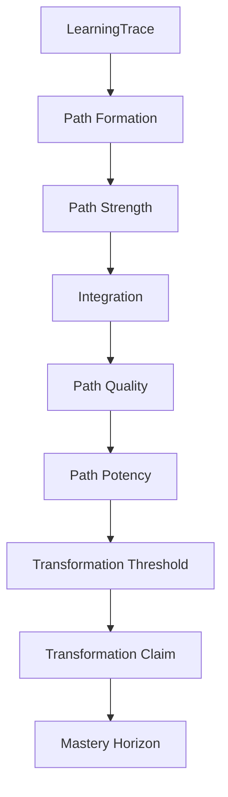

# LEF-1C — Path Quality and Mastery Hypothesis

## Governance Research Study (Capability Formation Investigation)

| Field | Value |
|-------|-------|
| **Study ID** | LEF-1C |
| **Parent** | [LEF-1B](LEF-1B-learningtrace-path-formation-hypothesis.md), [LEF-1A](LEF-1A-operationalizing-explicit-integration.md), [LEF-0E](LEF-0E-integration-theory.md) |
| **Date** | 2026-06-04 |
| **Status** | Complete (evidence only) |
| **Scope** | ChessGuide repository: `docs/governance/**`, LEF series |
| **Constraints** | No ADR, governance edits, runtime, scoring, federation, or Creator |

---

## 1. Executive Summary

LEF-1C asks **why some learning paths produce greater capability formation than others**, and whether **Path Quality**, **Path Potency**, and **Mastery** (as horizon) are meaningful beyond **Path Strength** (LEF-1B).

### Core answer

```text
Path Strength  ≠  Path Quality  ≠  Path Potency
```

| Concept | Verdict | One-line meaning |
|---------|---------|------------------|
| **Path Strength** | **Supported (interpretive)** | Path is **well-traveled, stable, persistent** — LEF-1B |
| **Path Quality** | **Supported (interpretive)** | Path **tends toward desirable integration outcomes** (transfer, judgment, self-correction) |
| **Path Potency** | **Supported (interpretive)** | Path **produces observable capability change** per episode span |
| **Transformation Threshold** | **Supported (interpretive)** | Point where change is **stable, replayable, steward-attestable** |
| **Mastery** | **Supported as horizon** | **Sustained high capability across continuity** — not a CB-000A chain stage |

### Why paths differ (repository synthesis)

Repetition and continuity **do not guarantee** improvement (CG-FLL-003 unintegrated repetition; CG-FLL-001 failure criteria). **Integration** (implicit/explicit) mediates between trace growth and **capability formation**. **Transformation** names observable change; **Mastery** names long-horizon stability (H6, expertise).

### Hypothesis status

**Path Quality** and **Path Potency** are **not falsified** — they explain cases LEF-1B strength alone cannot (strong trace, weak transfer). They are **interpretive extensions**, not schema fields.

---

## 2. Repository View of Mastery (Part 1)

### 2.1 Term inventory

| Term | Occurrences | Role |
|------|-------------|------|
| **mastery** | CG-FLL-001 H2; CG-FLL-002/003 H5–H6; CG-001 vision; FCS-001 horizon | **Long-term outcome / predictor**, not chain stage |
| **expertise** | CG-FLL-002 § Expertise; CG-FLL-003 § Continuity and Expertise | **Continuity expressed as capability**; compressed Observation→Knowledge |
| **capability** | CB-000A SkillTransformation; CG-FLL-002 transformation of **future capability** | Change target |
| **skill development** | CG-000, CB-002 LSDD, README | Domain framing |
| **competence** | LEF-0B cites Fintech DCF only — **not** native chessguide ontology | Out of scope for chess domain claims |
| **long-term improvement** | CG-001; pilot success criteria | Trajectory language |

### 2.2 How mastery is represented today

| Representation | Evidence |
|----------------|----------|
| **Hypothesis** | H2/H5/H6: continuity > intensity for mastery; engagement → continuity → integration → transformation (CG-FLL-003) |
| **Product vision** | “Build long-term mastery” (CG-001) |
| **Not in CB-005 schema** | No `mastery` field; Transformation **tags** only |
| **Not in runtime** | No mastery metric in `src/` |

### 2.3 Mastery vs Transformation

| Dimension | Transformation | Mastery |
|-----------|----------------|---------|
| **CB-000A chain** | **Terminus stage** — “what changed in capability” | **Not a chain stage** |
| **Time scale** | Episode span + steward validation | **Long horizon** across many episodes |
| **Evidence** | LOE-011, C4, IM-1, Part VIII categories | H6, expertise, continuity semantics |
| **Claim type** | Attested claim (steward-gated) | **Interpretive horizon** — no LOE type named “mastery” |

**Verdict:** Repository **differentiates** them implicitly: Transformation = **visible change event/claim**; Mastery = **sustained excellence over continuity**.

### 2.4 Part 1 conclusion

**Mastery is reconstructible** as **horizon language**, not as a federation primitive or chain replacement for Transformation.

---

## 3. Path Strength Revisited (Part 2)

### 3.1 LEF-1B reconstruction

Path Strength = **how entrenched the traversal pattern is** in LearningTrace.

| Dimension | Observable proxy (LEF-1B / LEF-1A) |
|-----------|--------------------------------------|
| **Persistence** | Trace custody; session return; continuity spacing |
| **Reuse** | LOE-004; same anchors (AN-4); opening recognition |
| **Stability** | LOE-002 recurring pattern across episodes |
| **Recurrence** | Repeated episodes; H6 repeated engagement |

### 3.2 What strength does not imply

| Counter-example | Source |
|-----------------|--------|
| Many games, same blunder | CG-FLL-003 “Repeated mistakes” |
| Random practice | CG-FLL-003 |
| Unintegrated repetition | CG-FLL-003; CG-FLL-001 failure criteria |
| High volume, no LOE | CG-FLL-1E I-3; `activity.*` tags |

### 3.3 Part 2 conclusion

**Path Strength measures traversability and entrenchment**, not **desirability** or **capability yield**.

---

## 4. Path Quality Hypothesis (Part 3)

### 4.1 Candidate definition

```text
Path Quality =
  the degree to which a learning path tends to produce
  desirable integration outcomes
  (transfer, judgment, durable integration, self-correction)
  rather than mere recurrence
```

### 4.2 Repository evidence for distinction

| Quality signal | Negative (low quality) | Positive (high quality) | Source |
|----------------|------------------------|-------------------------|--------|
| Integration depth | Unintegrated repetition | LOE-009, DOE-008, teaching LOE-010 | CG-FLL-003, CG-FLL-1E |
| Transfer | Single-context drill only | LOE-008 cross-episode | CG-FLL-1E, Part VIII |
| Progression | Stagnation (product question) | Part VIII improved observation/explanation/transfer | CG-001, CG-FLL-1E |
| Steward audit | Orphan activity | R4 gaps: activity without LOE | CG-FLL-1E Part VII |
| Recognition vs activity | Failure: indistinguishable from repetition | Success: distinguished from activity/exposure/repetition | CG-FLL-001 |

**“Local optimization”** — not named; closest: **opening-only drill** without LOE-008 (interpretive).

### 4.3 Part 3 conclusion

**Path Quality is meaningful (interpretive).** Repository **already distinguishes** learning-bearing progression from **repetition without integration** — Quality names **that normative axis**.

---

## 5. Path Potency Hypothesis (Part 4)

### 5.1 Candidate definition

```text
Path Potency =
  the degree to which traversals along a path
  produce observable capability change per unit continuity
```

(Unit is **not** scored — comparative narrative only per CG-FLL-1E Part IV.)

### 5.2 Contrasting potency vs strength

| Case | Strength | Potency | Repository grounding |
|------|----------|---------|----------------------|
| **Strong, low potency** | Many episodes, same anchors | Same mistakes, no LOE-007/008 | CG-FLL-003 repeated mistakes |
| **Weak, high potency** | Few episodes | LOE-008 transfer + LOE-009 + clear LOE-001 shift | Sparse trace, rich LOE |
| **Strong, high potency** | Long trace + LOE density | Part VIII categories improving; IM-1 gap narrows | Pilot ideal |
| **Weak, low potency** | Sparse activity tags | No integration events | I-3 failure pattern |

### 5.3 Part 4 conclusion

**Path Potency is meaningful (interpretive)** — answers “**how much capability change per path effort**,” not “**how worn is the path**.”

---

## 6. Capability Formation (Part 5)

### 6.1 Repository-supported chain

```text
LearningTrace (evidence custody)
        ↓
Path Formation (linked episodes/anchors — LEF-1B)
        ↓
Integration (implicit + explicit — LEF-0E)
        ↓
Capability Formation (observation capacity, judgment, transfer — CG-FLL-002)
        ↓
Transformation Signal / Claim (LOE-011, C4)
        ↓
Mastery Horizon (sustained high capability — interpretive)
```

**Integration is the mechanism; trace is not the mechanism** (LEF-0E).

### 6.2 How capability emerges

| Mechanism | Evidence |
|-----------|----------|
| Integration connects structures | CG-FLL-002 primary principle |
| Continuity increases integration | CG-FLL-003 H2 |
| Simulation / explanation / teaching | Integration mechanism list |
| Expertise compresses path | Observation→Knowledge with less conscious steps |
| Transformation makes learning visible | CG-FLL-003 H9 |

### 6.3 Part 5 conclusion

Capability formation is **reconstructible** as **integration-mediated change** recorded in trace — **not** trace volume alone.

---

## 7. Repetition vs Improvement (Part 6)

### 7.1 Model evaluation

| Model | Verdict |
|-------|---------|
| **A — Repetition naturally improves** | **Rejected** — CG-FLL-003 unintegrated repetition; CG-FLL-001 failure if indistinguishable from repetition |
| **B — Repetition may stagnate** | **Supported** — repeated mistakes; CG-001 “Why did I stagnate?” |
| **C — Improvement needs additional factors** | **Strongest** — integration (H4), continuity with progression, LOE linkage (I-3) |

### 7.2 Part 6 conclusion

**Model C** is repository canon. Repetition contributes to **Path Strength**, not automatically to **Quality** or **Potency**.

---

## 8. Transfer and Generalization (Part 7)

### 8.1 Repository links

| Concept | Evidence |
|---------|----------|
| **Transfer** | LOE-008; CG-FLL-001 Knowledge target; Part VIII improved transfer |
| **Generalization** | LOE-002 pattern across contexts; ALP generalisation (artifact domain) |
| **Adaptation** | LOE-007 self-correction; improved adaptability (CG-FLL-003 transformation evidence list) |

### 8.2 Do higher-quality paths produce greater transfer?

| Verdict | **Supported (qualitative)** |
|---------|----------------------------|
| Evidence | LOE-008 requires **cross-episode** link — weak paths lack refs; Part VIII lists transfer as transformation evidence category |
| Not scored | No transfer coefficient in repo |

### 8.3 Part 7 conclusion

**Transfer is the strongest observable proxy for Path Quality** in existing LOE catalogue.

---

## 9. Expert Compression (Part 8)

### 9.1 Repository evidence

| Phenomenon | Source |
|------------|--------|
| Expert vs novice observation | CG-FLL-002 Reality/Observation table |
| Compressed Observation→Knowledge | CG-FLL-002 Expertise; CG-FLL-003 |
| Novice sequential vs expert simultaneous chain | CG-FLL-002 chain behaviour table |
| Pattern recognition | LOE-002 |

### 9.2 Expertise as optimized path structure?

| Verdict | **Partially supported (interpretive)** |
|---------|----------------------------------------|
| **For** | Fewer explicit LOE steps needed for equivalent performance; “distance decreases” |
| **Against literal reading** | Experts may not log path — trace incomplete; compression is **capability**, not **file shape** |

### 9.3 Flow (user ladder — not repo term)

**Flow** is **not** in repository vocabulary. Closest interpretive mapping: **expert compression + spontaneous LOE-004** — optional label for **high-potency, low-friction traversal**, not studied as primitive here.

### 9.4 Part 8 conclusion

Expertise supports **high Path Potency** with **variable Path Strength** (sparse explicit events, rich capability).

---

## 10. Transformation Threshold (Part 9)

### 10.1 Candidate definition

```text
Transformation Threshold =
  point at which capability change is
  stable enough to be
  observed, replayed from trace, and steward-attested
```

### 10.2 Repository evidence

| Threshold element | Evidence |
|-------------------|----------|
| **Stable** | IM-1 gap narrowing over N episodes (CB-000A); CTV trend rules (R-3) |
| **Observable** | Part VIII categories; measured/perceived |
| **Replayable** | CG-FLL-001 I-4; R6 reconstructable |
| **Steward-attestable** | C4 verdict; LOE-011 only after supported C4 |
| **Not single episode** | CB-000A I-4 episodic success ≠ longitudinal transformation |

### 10.3 Distinction from Transformation claim

| Signal | Claim |
|--------|-------|
| Drift, tags, LOE-007/008 | LOE-011 + C4 after replay |

**Threshold is interpretive gate** between **Potency signals** and **Transformation claim**.

### 10.4 Part 9 conclusion

**Transformation Threshold is supported** — aligns with FLL-1 procedure, not a numeric cutoff in repo.

---

## 11. Mastery Horizon (Part 10)

### 11.1 Candidate definition

```text
Mastery Horizon =
  sustained high capability across continuity
  (not a single Transformation event)
```

### 11.2 Repository evidence

| Evidence | Role |
|----------|------|
| H6 continuity > intensity for mastery | Long span |
| H5 transformation observable through activity not sufficient | Need integration |
| Expertise = continuity expressed as capability | CG-FLL-003 |
| CG-001 long-term mastery | Product north star |
| Transformation is continuity made visible (H9) | Bridge — threshold events on path to horizon |

### 11.3 Not a chain stage

CB-000A ends at **Transformation** — **Mastery extends beyond** chain terminus as **horizon**, consistent with user model and repo hypotheses.

### 11.4 Part 10 conclusion

**Mastery is best understood as horizon**, not stage — **supported**.

---

## 12. Contrasting Cases (Part 11)

| Case | Supported? | Repository narrative |
|------|------------|----------------------|
| **A — Strong path, low quality** | **Yes** | High game count; unintegrated repetition; repeated mistakes (CG-FLL-003) |
| **B — Strong path, high quality** | **Yes** | Dense LOE/DOE; LOE-008; narrowing IM-1; C4 supported |
| **C — Weak path, high quality** | **Yes (sparse)** | Few episodes with strong LOE-008/009 — pilot may still validate |
| **D — Transformation without mastery** | **Yes** | Single supported C4 / short spike; episodic success ≠ longitudinal (CB-000A I-4) |
| **E — Mastery without recent transformation** | **Yes (interpretive)** | Stable expert — few new LOE-011; continuity + expertise without fresh claim |

---

## 13. Candidate Capability Formation Model (Part 12)

### 13.1 Extended model (repository-grounded + interpretive layers)

```text
LearningTrace                    [evidence — LEF-0A]
        ↓
Path Formation                   [LEF-1B]
        ↓
Path Strength                    [reuse, stability, persistence — LEF-1B]
        ↓
Integration (implicit | explicit) [LEF-0E / LEF-1A]
        ↓
Path Quality                     [transfer, self-correction, integration depth — LOE]
        ↓
Path Potency                     [capability change per continuity — IM-1, Part VIII]
        ↓
Transformation Threshold         [replay + C4 gate — CG-FLL-1E]
        ↓
Transformation Claim             [LOE-011]
        ↓
Mastery Horizon                  [H6, expertise — sustained capability]
```

### 13.2 Mermaid



### 13.3 Alternative rejected

```text
Path Strength alone → Mastery
```

**Rejected** — violates I-3, failure criteria, H4/H8.

---

## 14. Falsification Assessment (Part 13)

**Target:** Path Quality and Path Potency add **no explanatory value**.

| Test | Result |
|------|--------|
| Explain with Strength + Integration only | **Partial** — covers many cases |
| Explain strong trace + repeated mistakes | **Fails without Quality/Potency split** |
| Explain sparse trace + transfer LOE-008 | **Fails without Potency** |
| Explain transformation vs mastery horizon | **Fails without horizon term** |
| Collapse Quality into LOE catalogue | **Possible** — Quality is **bundle criterion** over LOE families F,G,C — still useful label |

### 14.1 Part 13 conclusion

Concepts **survive** falsification as **steward-facing interpretive vocabulary** — not mandatory schema fields.

---

## 15. Evidence Summary

| ID | Finding |
|----|---------|
| E-1C-1 | Path Strength ≠ Quality ≠ Potency — repetition cases prove distinction |
| E-1C-2 | Mastery = horizon; Transformation = stage/claim |
| E-1C-3 | Model C: improvement needs integration beyond repetition |
| E-1C-4 | LOE-008 = primary quality observable |
| E-1C-5 | Threshold = C4 + replay + LOE-011 gate |
| E-1C-6 | Expertise = high potency, variable logged strength |
| E-1C-7 | No scoring — observability only (LEF-1A alignment) |

---

## 16. Contradictions

| ID | Contradiction | Hold |
|----|---------------|------|
| C-1C-1 | CG-FLL-003 H9 “Transformation is continuity made visible” vs Mastery beyond single transformation | **Hold** — visibility event vs sustained horizon |
| C-1C-2 | More LOE = higher quality? | **Hold** — orphan LOE without integration still low quality (R4) |
| C-1C-3 | Potency vs measured engine CP | **Hold** — CP is Measured proxy, not sovereignty export; not sole potency |

---

## 17. Open Questions (for LEF-1D+)

| ID | Question |
|----|----------|
| OQ-1C-1 | Minimum LOE family mix for “high quality” path? |
| OQ-1C-2 | Should stewards record **Path Quality** tier (ordinal prose)? |
| OQ-1C-3 | Can **Flow** be operationalized without conflating coaching UX? |
| OQ-1C-4 | Mastery indicators without numeric rating — continuity length only? |
| OQ-1C-5 | Relationship between CB-006 **adaptive repetition** and Path Quality? |

---

## 18. Conclusion

### 18.1 Success criteria

| Criterion | Verdict |
|-----------|---------|
| Path Quality meaningful? | **Yes (interpretive)** |
| Path Potency meaningful? | **Yes (interpretive)** |
| Mastery vs Transformation? | **Distinct — horizon vs claim/stage** |
| Capability formation reconstructible? | **Yes — integration-mediated** |
| Transformation Threshold supported? | **Yes — procedural gate** |
| Mastery as horizon? | **Yes** |

### 18.2 Answer to core question

**Why do some paths produce greater capability formation?**

> They exhibit **higher Path Quality** (integration mechanisms that transfer and self-correct) and **higher Path Potency** (capability change visible per continuity span) — not merely **greater Path Strength** (more traversal).

### 18.3 First principle confirmed

```text
A strong path is not necessarily a good path.
A frequently traversed path is not necessarily a productive path.
```

**Supported by repository evidence.**

### 18.4 Compliance

Study only — no ADR, governance, runtime, federation, scoring, or Creator changes.

---

## Related

- [LEF-1B](LEF-1B-learningtrace-path-formation-hypothesis.md)
- [LEF-1A](LEF-1A-operationalizing-explicit-integration.md)
- [LEF-0E](LEF-0E-integration-theory.md)
- [CG-FLL-002](../../chessguide/CG-FLL-002-learning-semantics.md)
- [CG-FLL-003](../../chessguide/CG-FLL-003-learning-continuity-semantics.md)
- [CG-FLL-001](../../chessguide/CG-FLL-001-first-domain-learning-pilot.md)
