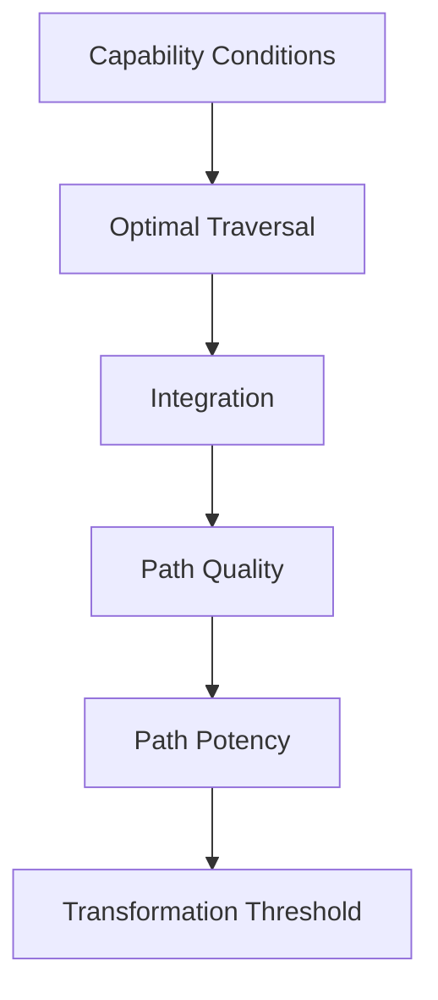

# LEF-1D — Flow and Optimal Traversal Hypothesis

## Governance Research Study (Capability Formation Acceleration Investigation)

| Field | Value |
|-------|-------|
| **Study ID** | LEF-1D |
| **Parent** | [LEF-1C](LEF-1C-path-quality-and-mastery-hypothesis.md), [LEF-1B](LEF-1B-learningtrace-path-formation-hypothesis.md), [LEF-0E](LEF-0E-integration-theory.md) |
| **Date** | 2026-06-04 |
| **Status** | Complete (evidence only) |
| **Scope** | ChessGuide repository; FIA-0 cited as **external** reference only |
| **Constraints** | No ADR, governance, runtime, federation, Creator |

---

## 1. Executive Summary

LEF-1D tests whether **Flow-like actor states** and **Optimal Traversal** explain why the **same LearningTrace path** can yield different **Path Potency** and **Transformation Threshold** timing.

### Core answer

| Question | Verdict |
|----------|---------|
| Can identical paths produce different outcomes depending on traversal? | **Yes** — modes, integration depth, expert compression (CB-006, CG-FLL-002) |
| Are Flow-like conditions meaningful? | **Yes (interpretive)** — not as scientific Flow; as **alignment of attention, challenge, autonomy, engagement, recovery** |
| Is Optimal Traversal meaningful? | **Yes (interpretive)** — traversal = **how** an episode is walked, not the trace geometry |
| Does Flow influence Path Potency? | **Plausible, partial** — via integration rate and LOE quality, not trace volume |
| Does Flow influence Transformation timing? | **Plausible, partial** — may shorten span to threshold **signals**; claim still steward-gated |
| Separate Capability Conditions track? | **Recommended** — repo has scattered signals; no unified model |

### Placement in LEF-1C stack

```text
Capability Conditions (actor + context state)
        ↓
Optimal Traversal (interpretive)
        ↓
Integration (implicit | explicit)
        ↓
Path Quality → Path Potency → Transformation Threshold → …
```

**Flow is not a property of the path file** — it is a **state hypothesis** affecting traversal effectiveness (user hypothesis; **supported interpretively**, not proven).

### FIA-0 status

**Flow Induction Assistance (FIA-0)** is **not** in this repository. LEF-1D maps FIA-0 dimensions to **nearest repo concepts** for alignment only — no adoption claim.

---

## 2. Flow Revisited (Part 1)

### 2.1 Repository search: “flow”

| Hit | Meaning |
|-----|---------|
| CB-006 Friendly Live | “without interrupting **flow**” | **Social play rhythm** — not epistemic Flow |
| Mermaid “flowchart” / “grounded flow” | Diagram / process prose | Irrelevant |
| LEF-1C | User ladder term deferred | Prior study |

**Verdict:** **Csikszentmihalyi-style Flow is not defined** in chessguide governance.

### 2.2 Repository concepts resembling Flow

| Flow-like dimension | Repository analogue | Strength |
|--------------------|---------------------|----------|
| **Deep engagement** | H6/H7 curiosity, enjoyment, intrinsic motivation (CG-FLL-001, CG-FLL-003) | Medium |
| **Attention** | Chain stage Attention; LOE-001; CB-005 attention log | Strong |
| **Immersion** | Simulation LOE-005; mental rehearsal (CG-FLL-002) | Partial |
| **Optimal challenge** | Training Live vs Friendly Live (CB-006); DOE-007 steward challenge | Partial |
| **Expert concentration** | Expert compression; novice vs expert chain table (CG-FLL-002) | Strong |
| **Uninterrupted play** | Friendly Live silent Buddy; Observation Only | Mode-specific |

### 2.3 FIA-0 mapping (external → repo)

| FIA-0 dimension | Nearest repo support |
|-----------------|---------------------|
| Challenge | DOE-007; Training mode; deviation signals |
| Feedback | Hints on request; IM-1; steward DOE-008 |
| Meaning | LOE-009; PP-3 understanding; CG-001 purpose |
| Attention | LOE-001; Attention stage |
| Energy | **Weak** — biological continuity H8 (CG-FLL-003) only |
| Recovery | Integration window note (CG-FLL-1E Part IX); BioChronos **out of repo** |
| Autonomy | PI-3; PP-4; CB-006 autonomy column |

### 2.4 Part 1 conclusion

**Flow-like conditions** are reconstructible as a **bundle of existing governance signals**, not as a single primitive.

---

## 3. Traversal vs Path (Part 2)

### 3.1 Definitions (interpretive)

```text
Path       =  structure in LearningTrace (episodes, anchors, event graph — LEF-1B)
Traversal  =  actor's enactment of one or more episodes along that path (this study)
```

### 3.2 Same path, different traversal — repository evidence

| Mechanism | Evidence |
|-----------|----------|
| **User mode** | CB-006: same Episode, different hint/CP/reflection capture |
| **Integration channel** | LEF-0E: implicit vs explicit on identical moves |
| **Expertise** | CG-FLL-002: same position, different observation (beginner vs GM table) |
| **Buddy intervention** | PP-7 reference vs decree; Training explains on request only |
| **Activity vs LOE** | I-3: same move count, different learning-bearing linkage |

### 3.3 Part 2 conclusion

**Path ≠ Traversal** is **supported**. LearningTrace records **what was available**; traversal determines **what was integrated** and **what events were produced**.

---

## 4. Capability Conditions (Part 3)

### 4.1 Candidate conditions — repository support

| Condition | Supported? | Evidence |
|-----------|------------|----------|
| **Focus / attention** | **Yes** | LOE-001; `perceived.focus`; Attention stage |
| **Motivation** | **Partial** | H6/H7; engagement — amplifier not proof (LEF-1A) |
| **Autonomy** | **Yes** | CB-001 PI-3; PP-4; CB-006 PI-3 per mode |
| **Recovery** | **Partial** | Integration window note; H8 biological continuity |
| **Persistence** | **Yes** | Continuity; trace custody; H6 |
| **Challenge alignment** | **Partial** | Training vs Friendly; DOE-007 — no “Goldilocks zone” schema |

### 4.2 Part 3 conclusion

**Capability Conditions** deserve a **separate research track** (FIA-0, LEF-1E+) — repo has **ingredients**, not **alignment model**.

---

## 5. Expert Compression (Part 4)

### 5.1 Repository evidence

| Phenomenon | Source |
|------------|--------|
| Intuition / pattern recognition | LOE-002; CG-FLL-002 Expertise |
| Compressed reasoning | RC-* therefore chains (ALP-1); expert Observation→Knowledge |
| Rapid evaluation | Less prompting (CG-FLL-1E Part IV); wisdom refs engine vs choice |

### 5.2 Optimized traversal?

| Verdict | **Partially supported** |
|---------|-------------------------|
| Expert traversal = **fewer explicit chain steps**, same or better potency | CG-FLL-002, CG-FLL-003 |
| **Not** identical to Flow — expert may be **low arousal, high skill**, not “in the zone” |

### 5.3 Part 4 conclusion

Expert compression is **one form of optimal traversal** — **high potency, low logged explicit integration**.

---

## 6. Flow and Path Potency (Part 5)

### 6.1 Hypothesis

```text
Flow-like conditions → higher Path Potency
(same path structure, more capability change per continuity span)
```

### 6.2 Supporting evidence

| Link | Mechanism |
|------|-----------|
| H2 continuity increases integration | More integration per episode → potency |
| H3 integrated learning shortens observation→knowledge | Faster capability uptake |
| Training mode + on-request coaching | Higher LOE density when engaged |
| Post-Game Review | Explanation + reflection → explicit integration burst |
| Part VIII categories | Improved observation/explanation when conditions align |

### 6.3 Counter-evidence

| Case | Source |
|------|--------|
| High engagement, no learning | CG-FLL-002 activity ≠ learning |
| Friendly Live: high flow (social), low LOE | CB-006 |
| Engine flood breaks autonomy | CB-004 prohibitions |

### 6.4 Part 5 conclusion

**Plausible and partial** — Flow-like states **amplify integration efficiency**, which **raises Path Potency** — not guaranteed.

---

## 7. Flow and Transformation Threshold (Part 6)

### 7.1 Can Flow accelerate threshold timing?

| Element | Evidence |
|---------|----------|
| **Faster integration** | H2/H3 — fewer episodes to LOE-008/011 **signals** |
| **Threshold still gated** | C4, replay, N-episode CTV (CB-000A R-3, I-4) |
| **Episodic spike ≠ claim** | Single great session insufficient |

### 7.2 Part 6 conclusion

Flow-like conditions may **advance Transformation signals earlier**; **Transformation claim** timing still **steward- and lineage-bound** — not collapsed by Flow.

---

## 8. Contrasting Cases (Part 7)

| Case | Path | Traversal / state | Expected potency | Repo anchor |
|------|------|-------------------|------------------|-------------|
| **A — Strong path + low flow** | Many episodes | Friendly Live, distraction, no LOE | Low | CB-006, repeated mistakes |
| **B — Strong path + high flow** | Many episodes | Training + reflection + LOE-008 | High | Pilot ideal |
| **C — Weak path + high flow** | Few episodes | Deep Post-Game + LOE-009/008 | Medium-high | LEF-1C Case C |
| **D — High activity + low flow** | Volume only | `activity.*` without integration | Low | I-3 |
| **E — Moderate activity + high flow** | Fewer, richer LOE | Aligned challenge + autonomy | High | Model C improvement |

**All cases interpretively supported** by existing docs.

---

## 9. Candidate Optimal Traversal Model (Part 8)

### 9.1 Model (repository-grounded + interpretive)

```text
Capability Conditions
  (attention, autonomy, challenge-fit, engagement, recovery window)
        ↓
Optimal Traversal
  (mode-appropriate enactment; expert compression as limit case)
        ↓
Integration (implicit | explicit)
        ↓
Path Quality
        ↓
Path Potency
        ↓
Transformation Threshold
        ↓
Transformation Claim → Mastery Horizon
```

### 9.2 Mermaid



**LearningTrace / Path Formation / Path Strength** sit **beside** this stack as **evidence substrate** (LEF-1B) — unchanged.

### 9.3 Alternative: traversal as mode-only

Could reduce Optimal Traversal to **CB-006 mode selection** without Flow vocabulary — **possible**, but **insufficient** for expert compression and integration windows.

---

## 10. Falsification Assessment (Part 9)

**Target:** Flow adds nothing beyond integration + path quality.

| Test | Result |
|------|--------|
| Explain B vs A cases with LOE only | **Partial** — modes explain capture, not **why** same person integrates more per hour |
| Explain expert without Flow term | **Partial** — compression suffices |
| Explain recovery window without Flow | **Fails** — integration window (Part IX) is **temporal condition**, not LOE type |
| Explain autonomy violations killing learning | **Fails** — PP-4/PI-3 are **state/policy**, not path |

### 10.1 Part 9 conclusion

**Flow / Optimal Traversal survives** as **actor-state layer** above path geometry. **Not scientifically proven** — **governance-useful**.

---

## 11. Evidence Summary

| ID | Finding |
|----|---------|
| E-1D-1 | “Flow” in repo = social rhythm or diagram, not epistemic primitive |
| E-1D-2 | Path ≠ Traversal — CB-006, I-3, expertise table |
| E-1D-3 | FIA-0 dimensions map partially to LOE/H6/PI-3/recovery note |
| E-1D-4 | Optimal Traversal explains potency variance at same path strength |
| E-1D-5 | Transformation claim timing not bypassed by Flow |
| E-1D-6 | Expert compression ⊆ optimal traversal limit case |

---

## 12. Contradictions

| ID | Contradiction | Hold |
|----|---------------|------|
| C-1D-1 | Friendly Live “flow” vs learning flow | **Hold** — homonym |
| C-1D-2 | More Buddy help = better traversal? | **Hold** — autonomy PP-4; flood prohibited |
| C-1D-3 | Flow vs Observation Only maximum autonomy | **Hold** — different goals (capture vs develop) |

---

## 13. Open Questions (for LEF-1E / FIA track)

| ID | Question |
|----|----------|
| OQ-1D-1 | Minimal Capability Condition bundle for “optimal” prose label? |
| OQ-1D-2 | Should CB-006 add **Traversal quality** field per episode? |
| OQ-1D-3 | Can FIA-0 be grounded in chessguide without importing foreign ontology? |
| OQ-1D-4 | Measure challenge-fit without numeric rating? |
| OQ-1D-5 | Does integration window note predict next-episode LOE density? |

---

## 14. Conclusion

### 14.1 Success criteria

| Criterion | Verdict |
|-----------|---------|
| Flow-like conditions meaningful? | **Yes (interpretive bundle)** |
| Optimal Traversal meaningful? | **Yes** |
| Flow influences Path Potency? | **Partial — via integration efficiency** |
| Flow influences Transformation timing? | **Partial — signals only** |
| Capability Conditions separate track? | **Yes — recommended** |

### 14.2 Answer to core question

> **Can some actor states produce greater capability formation from the same path?**

**Yes** — repository evidence via **modes (CB-006)**, **integration depth (LEF-0E/1A)**, **expert compression (CG-FLL-002/003)**, and **engagement/recovery context (H6/H8, integration window)**. **Optimal Traversal** names enactment quality; **Flow** is optional shorthand for **aligned Capability Conditions**, not a path property.

### 14.3 Relation to user stack

Inserts **above Integration** in the LEF-1C ladder:

```text
… → Path Strength → [Capability Conditions → Optimal Traversal] → Integration → Path Quality → …
```

Does not replace LearningTrace evidence role.

### 14.4 Compliance

Study only — no implementation, ADR, governance, federation, or Creator changes.

---

## Related

- [LEF-1C](LEF-1C-path-quality-and-mastery-hypothesis.md)
- [LEF-1B](LEF-1B-learningtrace-path-formation-hypothesis.md)
- [LEF-0E](LEF-0E-integration-theory.md)
- [CB-006 — User Modes](../../chessbuddy/CB-006-user-modes.md)
- [CG-FLL-002](../../chessguide/CG-FLL-002-learning-semantics.md)
- [CG-FLL-003](../../chessguide/CG-FLL-003-learning-continuity-semantics.md)
