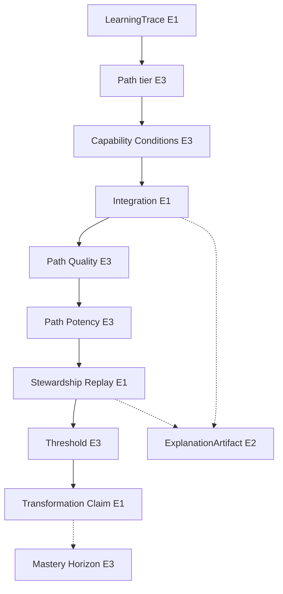

# LEF-2A — Capability Formation Architecture

## Governance Research Study (Architectural Synthesis and Stress Test)

| Field | Value |
|-------|-------|
| **Study ID** | LEF-2A |
| **Parent** | LEF-0A–0E, LEF-1A–1E (full line) |
| **Date** | 2026-06-04 |
| **Status** | Complete (adversarial synthesis) |
| **Scope** | ChessGuide repository + LEF study corpus |
| **Constraints** | No ADR, runtime, governance, federation, or Creator changes |

---

## 1. Executive Summary

LEF-2A performs the **first adversarial synthesis** of the LEF Capability Formation Architecture (CFA). The goal is **not** to preserve the model but to determine **whether it survives**.

### Architectural verdict

**Survives with modifications.**

| Outcome | Detail |
|---------|--------|
| **Survives** | Core separation: **evidence (trace) ≠ integration (process) ≠ transformation (outcome/claim) ≠ explanation (interpretive product)** |
| **Modifications** | Collapse **Path Formation + Path Strength** into one interpretive tier; treat **Traversal Quality** as **output label** of Conditions + Integration, not mandatory separate box; add explicit **Replay** and **Stewardship** layers omitted from user ladder |
| **Fails if** | Interpreted as **runtime schema**, **federation export model**, or **fully serial pipeline** without dynamic/recursive chain (CG-FLL-002) |

### Strongest concepts (E1)

LearningTrace (evidence role), Integration (CG-FLL-002), Transformation vs activity distinction (I-3), Stewardship gate (C4/LOE-011), LOE/DOE observability, federation export boundary (FEDERATION.md).

### Weakest / most collapsible (E3–E4)

Path Formation, Path Strength (merge), Flow (drop as architecture node), Mastery Horizon (horizon only — keep outside claim pipeline).

### Simplified public ladder (recommended)

```text
LearningTrace (evidence)
  → Longitudinal Path [interpretive: formation + strength]
  → Capability Conditions
  → Integration (implicit | explicit)
  → Path Quality → Path Potency [interpretive pair — keep distinct]
  → Stewardship (replay + threshold gate)
  → Transformation Claim
  → Mastery Horizon [outside claim pipeline]
```

**ExplanationArtifact:** cross-cutting at Integration (P1) and Stewardship (P2) — not a vertical rung.

---

## 2. Architectural Inventory (Part 1)

### 2.1 LEF-0 line (epistemology & explanation)

| ID | Concept | Source study | Role |
|----|---------|--------------|------|
| O-1 | LearningTrace = evidence + custody + trajectory | LEF-0A | Substrate |
| O-2 | Replay = reconstruction mechanism | LEF-0A | Cross-cut |
| O-3 | Learning ≠ Transformation | LEF-0A, 0E | Boundary |
| O-4 | LearningExplanation (specialization) | LEF-0B | Domain gap-fill |
| O-5 | ExplanationArtifact (genus) | LEF-0C | Interpretive product |
| O-6 | ExplanationArtifact P1 episodic / P2 attested | LEF-0D | Placement |
| O-7 | Integration Theory (implicit \| explicit channels) | LEF-0E | Process plane |

### 2.2 LEF-1 line (operationalization & path)

| ID | Concept | Source study | Role |
|----|---------|--------------|------|
| P-1 | Explicit Integration observability (LOE/DOE) | LEF-1A | Indicators |
| P-2 | Path Formation | LEF-1B | Interpretive |
| P-3 | Path Strength | LEF-1B | Interpretive |
| P-4 | Path Quality | LEF-1C | Interpretive normative |
| P-5 | Path Potency | LEF-1C | Interpretive yield |
| P-6 | Transformation Threshold | LEF-1C | Gate signal |
| P-7 | Transformation Claim (LOE-011/C4) | LEF-1C | Governed outcome |
| P-8 | Mastery Horizon | LEF-1C | Long-horizon |
| P-9 | Path ≠ Traversal | LEF-1D | Boundary |
| P-10 | Optimal Traversal / Flow (emergent) | LEF-1D | Enactment |
| P-11 | Capability Conditions | LEF-1E | Environment |
| P-12 | Traversal Quality | LEF-1E | Enactment quality |

### 2.3 Repository primitives (non-LEF names)

| Primitive | Document |
|-----------|----------|
| Federation learning chain | CB-000A |
| LOE / DOE catalog | CG-FLL-1E |
| User modes | CB-006 |
| I-3 activity ≠ learning | CG-FLL-001 |
| ObservationRecord export | FEDERATION.md, FCI-5c |

### 2.4 Dependency graph (summary)



---

## 3. Evidence Classification (Part 2)

| Concept | Class | Rationale |
|---------|-------|-----------|
| **LearningTrace** (evidence/custody) | **E1** | CB-005, CB-000A, LEF-0A |
| **Integration** (process) | **E1** | CG-FLL-002 primary principle |
| **Transformation** (capacity change) | **E1** | CB-000A chain terminus |
| **Transformation claim** (steward-gated) | **E1** | I-1, I-2, LOE-011 procedure |
| **Activity ≠ learning** | **E1** | I-3, CG-FLL-002 |
| **LOE / DOE events** | **E1** | CG-FLL-1E catalog |
| **Replay** (reconstruction) | **E1** | I-4, Part VII |
| **Stewardship** (validation) | **E1** | CG-FLL-1E Part VI |
| **User modes** (traversal policy) | **E1** | CB-006 |
| **Autonomy / PI-3** | **E1** | CB-001 |
| **Federation game export only** | **E1** | FEDERATION.md |
| **ExplanationArtifact** (genus) | **E2** | Coherent; not CB-005 schema |
| **LearningExplanation** | **E2** | LEF-0B; pilot-only |
| **IM-1 Measured/Perceived** | **E2** | CB-005 fields; partial runtime |
| **Continuity** (longitudinal) | **E2** | CG-FLL-003; hypotheses H6/H8 |
| **Path Quality / Path Potency** | **E3** | LEF-1C; LOE proxies |
| **Capability Conditions** | **E3** | LEF-1E; scattered repo signals |
| **Traversal Quality** | **E3** | LEF-1D–1E; derivative |
| **Path Formation / Path Strength** | **E3** | LEF-1B metaphor on trace |
| **Transformation Threshold** | **E3** | Procedural gate; not numeric |
| **Mastery Horizon** | **E3** | H6/H6 wording; not LOE type |
| **Flow** | **E4** | Social “flow” CB-006 only; rest emergent |
| **Path Potency “unit”** | **E4** | No scored unit in repo |
| **FIA-0 alignment** | **E4** | External to repository |

---

## 4. Dependency Analysis (Part 3)

### 4.1 Depends on LearningTrace

| Dependent | Dependency type |
|-----------|-----------------|
| Path Formation/Strength | **Evidence graph** |
| Integration (both channels) | **Events + episodes** |
| Path Quality/Potency | **LOE linkage** |
| Transformation Threshold/Claim | **Lineage I-1** |
| ExplanationArtifact | **evidence_refs[]** |
| Capability Conditions | **Independent of trace geometry** but **observed via** trace capture (modes) |

### 4.2 Depends on Integration

| Dependent | Why |
|-----------|-----|
| Path Quality | Integration mechanisms produce quality signals |
| Path Potency | CG-FLL-002: learning = integration achieved |
| Transformation **signals** | H5 observable through transformation |
| Mastery (horizon) | Continuity + integration over N episodes |

### 4.3 Depends on Transformation (concept)

| Dependent | Relationship |
|-----------|--------------|
| Transformation Claim | **Instance of** governed transformation |
| Mastery Horizon | **Sustained** transformation-like capability state |
| LearningExplanation | **Explains** transformation (specialization) |

### 4.4 Relatively independent

| Concept | Independence |
|---------|--------------|
| **Capability Conditions** | Policy + actor state; **modulates** trace capture, not stored as path |
| **Federation ObservationRecord** | **Subset** of trace (completed game) — no learning stack |
| **Buddy pedagogy** | UX layer; sovereign |

---

## 5. Architectural Redundancy Test (Part 4)

| Candidate collapse | Verdict | Evidence |
|--------------------|---------|----------|
| **A — Path Quality = Path Potency** | **Reject** | LEF-1C: normative tendency vs capability yield; Case A strong/low potency |
| **B — Capability Conditions = Traversal Quality** | **Partial merge OK** | Traversal Quality is **derivative label**; Conditions are **inputs** — keep Conditions, optional Traversal label |
| **C — Threshold = Claim** | **Reject** | Signals (IM-1, tags) vs C4/LOE-011 gate |
| **D — Path Formation = Path Strength** | **Merge recommended** | Both E3; strength adds little if formation includes anchors + recurrence |
| **E — Mastery = Transformation** | **Reject** | CB-000A stage vs H6 horizon; episodic I-4 |

---

## 6. Missing Layer Analysis (Part 5)

| Missing from user ladder | Severity | Add |
|--------------------------|----------|-----|
| **Replay** | **High** | Parallel to Integration → Stewardship |
| **Stewardship** (C0–C4) | **High** | Between Potency and Claim |
| **IM-1** (gap discipline) | **Medium** | Under Conditions or Feedback |
| **Activity channel** (`activity.*`) | **Medium** | Negative space for I-3 |
| **User mode** | **Medium** | Encodes Conditions in product |
| **Federation export slice** | **High** | Parallel branch — not learning CFA |

**Not missing:** Explanation — placed cross-cutting (Part 7).

---

## 7. Continuity Analysis (Part 6)

| Question | Verdict |
|----------|---------|
| Foundational? | **Yes (E2)** — CB-000A trajectory; CG-FLL-003 “integration through continuity” |
| Supportive? | **Also** — H6 engagement amplifier |
| Optional? | **No** for durable claims; **yes** for single-episode observation |

Continuity operates **horizontally** across all tiers (time ordering), not as a single vertical box.

---

## 8. ExplanationArtifact Placement (Part 7)

| Placement option | Verdict |
|------------------|---------|
| Integration layer | **P1 episodic** — LOE-009 (LEF-0D) |
| Transformation layer | **P2 attested** — pre-LOE-011 (LEF-0D) |
| Separate explanatory layer | **Recommended** — **orthogonal** to vertical CFA |

```text
Integration ──► ExplanationArtifact (P1 optional)
Stewardship  ──► ExplanationArtifact (P2 when claim-grade)
```

**Not** a rung in main ladder; **bridge** between interpretation and claim.

---

## 9. Implicit vs Explicit Integration (Part 8)

### 9.1 Coexistence

| Verdict | **Required** — CG-FLL-002 dynamic chain; expert compression implicit; pilot explicit for claims |
|---------|--------------------------------|

### 9.2 Candidate dual-path model

```text
        ┌─ Implicit channel (pattern uptake, compression)
Integration ─┤
        └─ Explicit channel (LOE/DOE, replay-visible)
                ↓
        Converge at Path Potency assessment
```

**Governance rule:** **Claims** require **explicit channel evidence** or steward inference documented (LEF-0E, CG-FLL-001).

---

## 10. Failure Modes (Part 9)

| Failure mode | Mechanism | Repo anchor |
|--------------|-----------|-------------|
| Strong path, low potency | Volume without LOE | I-3, LEF-1C Case A |
| Strong path, poor conditions | Wrong mode / fatigue | LEF-1E Case A |
| Repetition without integration | Unintegrated repetition | CG-FLL-003 |
| Transformation without mastery | Episodic spike | CB-000A I-4 |
| Mastery degradation | Not named — infer skill loss + continuity break | **Uncertainty E4** |
| High activity, low flow/conditions | Case D LEF-1E | |
| False transformation | Outcome luck | LEF-0B falsifier |
| Explanation without integration | Verbal only | LOE-009 without LOE-007/008 |

**CFA value:** failure modes **justify** separate Quality vs Potency vs Conditions — **cannot collapse** to trace alone.

---

## 11. Cross-Domain Analysis (Part 10)

| Domain | Generalization | Evidence |
|--------|--------------|----------|
| **ChessGuide** | Primary empirical anchor | CG-FLL-*, CB-* |
| **Education / skill** | **Plausible** | CB-000A generic chain; ALP artifact learning |
| **Expertise** | **Plausible** | Expert compression CG-FLL-002/003 |
| **Leadership** | **Weak** | Not in repo |
| **Scientific practice** | **Partial** | ALP meta-learning; DCF cited only in LEF studies |
| **BioChronos** | **Continuity substrate** | FCS-001; H8 biological; not learning export |

FCS-001: **Federation Continuity** candidate is **domain-agnostic**; CFA **learning stack** is **domain-sovereign** with **generic pattern** (evidence → integration → validated transformation).

**Verdict:** Architecture **generalizes at pattern level**, **not** at LOE/chess event level.

---

## 12. Federality Analysis (Part 11)

| Concept | Domain-specific | Federation-candidate |
|---------|-----------------|----------------------|
| **LearningTrace** (pattern) | Implementation per domain | **Trace / continuity pattern** (FCS-001, CTP planned) |
| **Completed game export** | ChessGuide | **ObservationRecord** T3 — **implemented** |
| **LOE/DOE** | ChessGuide pilot | **No** — sovereign |
| **ExplanationArtifact** | Per domain | **No export** (FEDERATION.md); opaque payload principle |
| **Integration** | Semantic per domain | **Principle only** — not wire format |
| **Capability Conditions** | Product policy | **No** |
| **Transformation claim** | Steward procedure | **CTV pattern** — governance cross-domain |
| **Capability Conditions / Path metaphor** | Interpretive | **No** |

**Rule:** Federation transports **continuity evidence**; domains retain **learning CFA**.

---

## 13. Minimal Architecture Test (Part 12)

### 13.1 Cannot remove

| Tier | Why |
|------|-----|
| **Evidence container** | Chain rule, replay |
| **Integration** | CG-FLL-002 definition of learning |
| **Stewardship + claim gate** | I-1, I-2 |
| **Activity vs learning distinction** | Pilot validity |

### 13.2 Can remove (without losing repo claims)

| Removable | Savings |
|-----------|---------|
| Path Formation **and** Path Strength → **Longitudinal Path** | −1 box |
| Flow | −1 box |
| Traversal Quality (keep Conditions only) | −1 box |
| Mastery Horizon (document outside pipeline) | −1 box |
| Path Quality **or** Potency (risky — lose failure mode vocabulary) | **Keep both** per adversarial test |

### 13.3 Minimal diagram

```text
Evidence (LearningTrace)
  → Conditions (modes, autonomy, attention policy)
  → Integration (implicit | explicit, LOE/DOE)
  → Outcome assessment (quality + potency interpretive)
  → Stewardship (replay, C4)
  → Transformation Claim
```

---

## 14. Adversarial Falsification (Part 13)

### 14.1 Simpler competing model

**Model X:** `Evidence + Steward attestation → Transformation`

| Test | Result |
|------|--------|
| Explains CB-000A chain | **Partial** — skips Attention→Understanding semantics |
| Explains I-3 | **Fails** without integration/LOE |
| Explains failure modes | **Fails** |
| Explains expert compression | **Fails** |
| Explains FLL-1 observability | **Fails** |

**Verdict:** Model X **too thin** for repository governance corpus; CFA **justified** as **steward-facing** architecture, not minimal ontology.

### 14.2 Remove major concepts?

| Concept removed | Survivability |
|-----------------|---------------|
| All path metaphor | **Survives** with LOE-only wording |
| Conditions | **Weakened** — modes unexplained |
| Quality/Potency | **Weakened** — repetition conflation returns |
| Threshold | **Collapses into Claim** — loses signal/claim distinction |

### 14.3 Relationship collapse?

Serial ladder **overstates** rigidity — CG-FLL-002 **dynamic/recursive** chain **contradicts** strict seriality. CFA must be read as **logical dependencies**, not **runtime pipeline**.

---

## 15. Candidate Architectures (Part 14)

### A — Current Architecture (14 rungs + Flow)

| Strength | Weakness |
|----------|----------|
| Fine-grained failure vocabulary | Proliferation; E3/E4 heavy |
| Matches LEF-1 research granularity | Replay/Stewardship implicit |

### B — Reduced Architecture (recommended)

```text
LearningTrace
  → Longitudinal Path [formation + strength]
  → Capability Conditions
  → Integration (implicit | explicit)
  → Path Quality → Path Potency
  → Stewardship [replay + threshold]
  → Transformation Claim
  → Mastery Horizon [documentation only]
```

| Strength | Weakness |
|----------|----------|
| Retains falsification power | Still interpretive heavy |
| Adds missing Stewardship | Less granular than LEF-1 |

### C — Alternative (process-centric)

```text
Evidence
  → Integration Environment (conditions + modes)
  → Integration (process)
  → Validation (replay + explanation P2 + C4)
  → Transformation
```

| Strength | Weakness |
|----------|----------|
| Fewer metaphors | Loses Path Potency/Quality distinction stressed in LEF-1C |

### 15.1 Comparison verdict

**B wins** for **survival + simplicity + repo alignment**.

---

## 16. Architectural Verdict (Part 15)

| Criterion | Result |
|-----------|--------|
| **Survives?** | **Yes — with modifications (Architecture B)** |
| **Strongest concepts** | LearningTrace role, Integration, activity boundary, Stewardship, LOE/DOE |
| **Weakest concepts** | Flow, Path Formation/Strength as separate tiers, Potency metrics |
| **Federation candidates** | Trace pattern, ObservationRecord export, continuity ID — **not** CFA ladder |
| **Simplification possible?** | **Yes** — merge path tiers; drop Flow rung; externalize Mastery |
| **Generalizes beyond ChessGuide?** | **Pattern yes; chess LOE no** |

**Does not fail** adversarial review.

**Does not** mandate implementation or federation export of learning semantics.

---

## 17. Evidence Summary

| ID | Finding |
|----|---------|
| E-2A-1 | CFA core triple **evidence → integration → governed transformation** is E1-anchored |
| E-2A-2 | Path metaphor tiers are E3 — mergeable |
| E-2A-3 | Quality ≠ Potency collapse **rejected** |
| E-2A-4 | Threshold ≠ Claim collapse **rejected** |
| E-2A-5 | Replay + Stewardship were **missing** from candidate ladder |
| E-2A-6 | ExplanationArtifact **cross-cutting**, not vertical |
| E-2A-7 | Serial diagram **contradicted** by dynamic chain — use logical deps |
| E-2A-8 | FEDERATION.md **prunes** CFA for export |

---

## 18. Contradictions

| ID | Issue | Resolution |
|----|-------|------------|
| C-2A-1 | LEF studies proliferate boxes; repo has **fewer** primitives | CFA is **steward interpretive** overlay, not schema |
| C-2A-2 | CG-FLL-002 non-linear vs LEF ladder linear | Read ladder as **dependency**, not schedule |
| C-2A-3 | LearningExplanation vs ExplanationArtifact vs Understanding stage | Keep **Understanding** = chain stage; **ExplanationArtifact** = product |
| C-2A-4 | Transformation terminus vs Mastery horizon | **Hold both** — different time scale |

---

## 19. Open Questions (post-LEF-2)

| ID | Question |
|----|----------|
| OQ-2A-1 | Publish **Architecture B** as canonical diagram in governance index? |
| OQ-2A-2 | Map LOE types to **minimal** vs **claim-grade** integration paths? |
| OQ-2A-3 | When does CFA justify **product schema** vs remain docs-only? |
| OQ-2A-4 | Single **LEF-2B** runtime observability study? |
| OQ-2A-5 | Align CFA with FCS-001 Federation Continuity wording |

---

## 20. Conclusion

The **Capability Formation Architecture survives adversarial synthesis** as a **coherent, repository-grounded explanatory model** when:

1. **Modified** to Architecture **B** (merged path tier, explicit Stewardship, no Flow rung).  
2. Read as **logical dependencies**, not a strict runtime pipeline.  
3. **ExplanationArtifact** treated as **cross-cutting**, not a rung.  
4. **Federation boundary** respected — CFA is **sovereign learning**, not export envelope.

LEF-0 and LEF-1 lines are **not invalidated**; they are **compressed** for operational use. Weakest tiers may be **retired from canonical diagrams** without losing evidentiary force.

**Purpose met:** model **tested**, not preserved for elegance alone.

---

## Related

- [LEF-0E — Integration Theory](LEF-0E-integration-theory.md)
- [LEF-1C — Path Quality and Mastery](LEF-1C-path-quality-and-mastery-hypothesis.md)
- [LEF-1E — Capability Conditions](LEF-1E-capability-conditions-hypothesis.md)
- [FCS-001 — Federation Continuity Study](../FCS-001-federation-continuity-study.md)
- [FEDERATION.md](../../../FEDERATION.md)
- [CB-000A — Longitudinal Learning Model](../../chessbuddy/CB-000A-longitudinal-learning-model.md)
