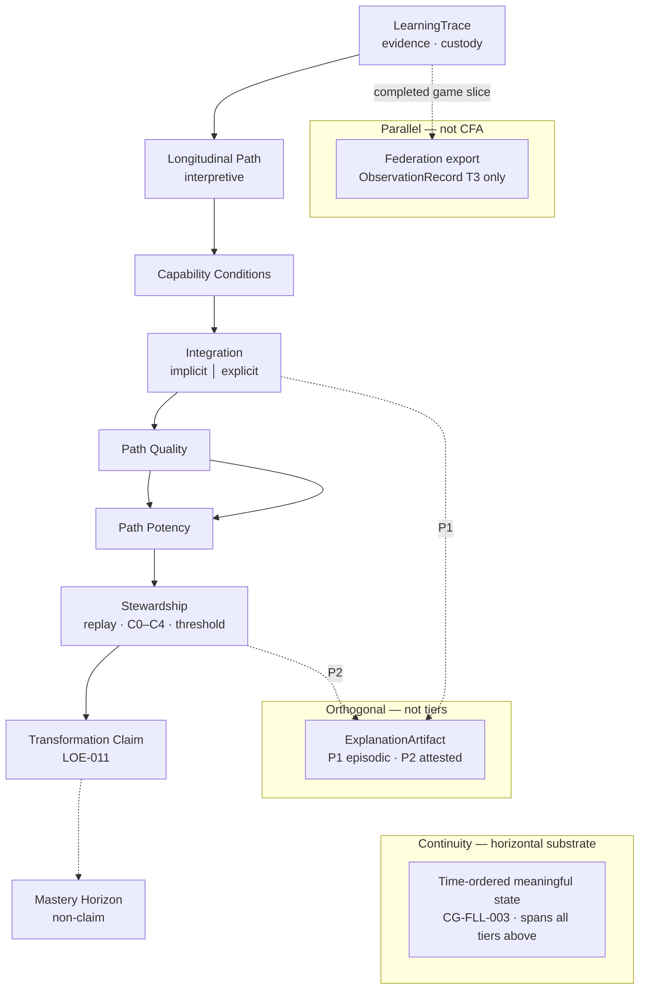

# LEF-2B — Canonical CFA Diagram and Terminology

## Governance Research Study (Canonical Representation Phase)

| Field | Value |
|-------|-------|
| **Study ID** | LEF-2B |
| **Parent** | [LEF-2A — Capability Formation Architecture](LEF-2A-capability-formation-architecture.md) |
| **Date** | 2026-06-04 |
| **Status** | Complete |
| **Scope** | Canonicalization only — no new concepts or ontology |
| **Constraints** | No ADR, runtime, federation, Creator, or new LEF hypotheses |

---

## 1. Executive Summary

LEF-2B fixes **one diagram**, **one vocabulary**, and **one onboarding path** for the Capability Formation Architecture (CFA) after LEF-2A’s adversarial synthesis.

### Official recommendation

| Artifact | Location | Version |
|----------|----------|---------|
| **Canonical diagram** | Section 9–10 below | **CFA Diagram v1.0** |
| **Canonical vocabulary** | Section 12 | **CFA Glossary v1.0** |
| **Onboarding entry** | Section 14 + README link | **15-minute path** |

### Answers to the core question

> If a new contributor joins ChessGuide one year from now, what is the single diagram and vocabulary they should learn first?

**Diagram:** **Architecture B** (LEF-2A) as **CFA v1.0** — nine logical tiers plus orthogonal layers.

**Vocabulary:** Nine **canonical tier names** + three **orthogonal terms** (Continuity, ExplanationArtifact, Federation export).

**Rule:** CFA expresses **logical dependencies**, not a runtime pipeline (CG-FLL-002 dynamic chain).

### Compression outcomes

| Action | Detail |
|--------|--------|
| **Canonical** | Architecture B; merged **Longitudinal Path**; single **Stewardship** box |
| **Retired from high-level diagrams** | Flow, Traversal Quality, Path Formation, Path Strength (aliases only) |
| **Subsumed** | Transformation Threshold → inside Stewardship |
| **Orthogonal** | ExplanationArtifact (cross-cutting); Continuity (horizontal) |

---

## 2. Terminology Audit (Part 1)

### 2.1 Canonical terms (use in diagrams and onboarding)

| Canonical | Role |
|-----------|------|
| **Capability Formation Architecture (CFA)** | Name of the steward-facing explanatory model |
| **LearningTrace** | Evidence container (CB-005, CB-000A) |
| **Longitudinal Path** | Interpretive reading of trace over time (LEF-1B → 2A merge) |
| **Capability Conditions** | Environment for enactment (modes, autonomy, attention) |
| **Integration** | Process plane; learning = integration achieved (CG-FLL-002) |
| **Path Quality** | Normative tendency of path (LEF-1C) |
| **Path Potency** | Capability yield from path (LEF-1C) |
| **Stewardship** | Replay, checkpoints C0–C4, threshold signals, claim gate |
| **Transformation Claim** | Governed LOE-011 / C4 outcome (CG-FLL-1E) |
| **Mastery Horizon** | Long-horizon outcome; not a claim step |
| **ExplanationArtifact** | Interpretive product genus (LEF-0C) |
| **Continuity** | Time-ordered preservation of meaningful state (CG-FLL-003, FCS-001) |

### 2.2 Aliases (valid in deep docs; not on v1.0 diagram)

| Alias | Maps to | Source |
|-------|---------|--------|
| Path Formation | Longitudinal Path | LEF-1B |
| Path Strength | Longitudinal Path | LEF-1B |
| Transformation Threshold | Stewardship (pre-claim signals) | LEF-1C |
| Traversal Quality | Capability Conditions + Integration enactment | LEF-1D–1E |
| Flow / Optimal Traversal | Emergent enactment (do not diagram) | LEF-1D |
| LearningExplanation | ExplanationArtifact specialization | LEF-0B |
| Evidence / trace substrate | LearningTrace | LEF-2A minimal model |
| Transformation (noun) | Outcome type; distinct from **Transformation Claim** | CB-000A |

### 2.3 Deprecated wording (avoid in new high-level material)

| Deprecated | Replace with | Reason |
|------------|--------------|--------|
| “Learning pipeline” | **Logical dependencies** | Contradicts CG-FLL-002 recursion |
| “Flow stage” | *(omit)* or “enactment quality” in prose | CB-006 “social play flow” only |
| “Path = traversal” | **Path** vs **enactment** | LEF-1D boundary |
| “Trace proves transformation” | **Trace supports lineage**; claim needs stewardship | I-1, I-2 |
| “Federation exports learning” | **Federation exports continuity evidence** | FEDERATION.md |

### 2.4 Overlapping repo-native terms (not CFA tier names)

| Repo term | Relationship to CFA |
|-----------|---------------------|
| **Attention → Understanding → … → Transformation** | CB-000A **chain stages** — orthogonal axis to CFA tiers |
| **LOE / DOE** | **Observability** of Integration and Stewardship — not separate CFA rungs |
| **Replay** | **Mechanism inside Stewardship** (CG-FLL-1E Part VII) |
| **Game / GameHistory** | Runtime evidence substrate; partial LearningTrace projection |

---

## 3. Naming Stability (Part 2)

| Name | Stability | Confusion risk | Official? |
|------|-----------|----------------|-----------|
| **LearningTrace** | **High (E1)** | Low — matches CB-005 product name | **Yes** |
| **Longitudinal Path** | **Medium (E3)** | Medium — new merge label; CB-000A says “longitudinal” | **Yes** (CFA tier) |
| **Capability Conditions** | **Medium (E3)** | Low if tied to CB-006 modes | **Yes** |
| **Integration** | **High (E1)** | Low — CG-FLL-002 primary principle | **Yes** |
| **Path Quality** | **Medium (E3)** | Medium — “quality” overloaded in product | **Yes** |
| **Path Potency** | **Medium (E3)** | High — sounds like metric; not scored in repo | **Yes** (keep pair with Quality) |
| **Stewardship** | **High (E1)** | Low — matches CG-FLL-1E Part VI | **Yes** |
| **Transformation Claim** | **High (E1)** | Medium — distinguish from **Transformation** stage | **Yes** |
| **Mastery Horizon** | **Low–medium (E3)** | High — sounds like claim | **Yes** (annotated “non-claim”) |
| **ExplanationArtifact** | **High (E2)** | Low — stable from LEF-0C | **Yes** (orthogonal) |

**Naming rule for contributors:** Use **Transformation Claim** when referring to LOE-011/C4; use **Transformation** only for CB-000A chain stage or capacity-change outcome.

---

## 4. Diagram Candidate Review (Part 3)

| Candidate | LEF-2A verdict | Canonical? |
|-----------|----------------|------------|
| **A** — Full 14-rung ladder + Flow | Too granular; missing Stewardship box | **No** |
| **B** — Reduced nine tiers + orthogonal layers | Recommended | **Yes → CFA v1.0** |
| **C** — Process-centric four boxes | Loses Quality/Potency failure vocabulary | **No** (retain as appendix mental model only) |

**Evidence:** LEF-2A §14–16; redundancy tests require Quality ≠ Potency; Stewardship E1 from CG-FLL-1E.

---

## 5. ExplanationArtifact Placement (Part 4)

| Option | Verdict |
|--------|---------|
| A — Inside ladder | **Reject** — conflates product with stages |
| B — Outside ladder only in prose | **Weak** — invisible in diagram |
| **C — Cross-cutting layer** | **Canonical** — LEF-0D P1/P2, LEF-2A |
| D — Separate diagram | **Supplement** — use for explanation-only deep dives |

**Visual rule (v1.0):** Dotted edges from **Integration** (P1 episodic) and **Stewardship** (P2 attested) to **ExplanationArtifact** band.

---

## 6. Continuity Representation (Part 5)

| Option | Verdict |
|--------|---------|
| A — Vertical stage | **Reject** — duplicates LearningTrace |
| **B — Horizontal substrate** | **Canonical** — CG-FLL-003, FCS-001 |
| C — External condition only | **Partial** — conditions are separate tier |
| D — Separate layer | **Same as B** in v1.0 (labeled substrate) |

**Visual rule:** **Continuity** appears as a **horizontal band beneath** the vertical dependency stack, not a rung.

---

## 7. Implicit vs Explicit Integration (Part 6)

| Representation | Verdict |
|----------------|---------|
| Separate branches | **Optional** — deep-dive only |
| **Labels on Integration box** | **Canonical for v1.0** |
| Separate diagram | **Appendix** — LEF-0E / LEF-1A references |

**Annotation on Integration box:**

```text
Integration
  implicit │ explicit
```

**Governance footnote (always with diagram):** Transformation **claims** require **explicit-channel** evidence or documented steward inference (CG-FLL-001, LEF-0E).

---

## 8. Stewardship Placement (Part 7)

| Question | Canonical answer |
|----------|------------------|
| Single box? | **Yes** — **Stewardship** on v1.0 |
| Sub-diagram? | **CG-FLL-1E** for C0–C4, replay, LOE-011 procedure |
| Separate governance layer? | **Conceptually yes** — same box, footnote to FLL-1E |

**Inside Stewardship (not separate v1.0 rungs):**

| Component | Repo anchor |
|-----------|-------------|
| **Replay** | CG-FLL-1E Part VII; I-4 |
| **Transformation Threshold** | IM-1, signal tags — pre-claim |
| **C0–C4** | CG-FLL-1E stewardship checkpoints |
| **LOE-011** | Issued only after C4 **supported** (or qualified) |

---

## 9. Canonical CFA Diagram — ASCII (Part 8)

### CFA Diagram v1.0 (ASCII)

```text
                    ┌─────────────────────────────────────┐
                    │     ExplanationArtifact (orthogonal) │
                    │  P1 episodic ←── Integration         │
                    │  P2 attested  ←── Stewardship        │
                    └─────────────────────────────────────┘
                                      ···
    LOGICAL DEPENDENCIES (not runtime pipeline)
    ═══════════════════════════════════════════

    ┌─────────────────┐
    │  LearningTrace  │  evidence · custody · trajectory
    └────────┬────────┘
             ▼
    ┌─────────────────┐
    │ Longitudinal    │  interpretive: recurrence · anchors
    │     Path        │  (alias: path formation + strength)
    └────────┬────────┘
             ▼
    ┌─────────────────┐
    │  Capability     │  modes · autonomy · attention policy
    │   Conditions    │
    └────────┬────────┘
             ▼
    ┌─────────────────┐
    │  Integration    │  implicit │ explicit
    │                 │  learning = integration achieved
    └────────┬────────┘
             ▼
    ┌─────────────────┐     ┌─────────────────┐
    │  Path Quality   │ ──► │  Path Potency   │
    └────────┬────────┘     └────────┬────────┘
             └──────────┬───────────┘
                        ▼
    ┌─────────────────┐
    │  Stewardship    │  replay · C0–C4 · threshold · gate
    └────────┬────────┘
             ▼
    ┌─────────────────┐
    │ Transformation  │  LOE-011 after C4
    │     Claim       │
    └────────┬────────┘
             │
             ▼  (non-claim horizon)
    ┌─────────────────┐
    │ Mastery Horizon │  long-horizon capability state
    └─────────────────┘

    ═══════════════════════════════════════════
    CONTINUITY (horizontal substrate — all tiers)
    time-ordered state · CG-FLL-003 · FCS-001 pattern

    ─ ─ ─ parallel (not CFA tier) ─ ─ ─
    Federation export: completed game ObservationRecord only
    (FEDERATION.md — sovereign learning retained)
```

---

## 10. Canonical CFA Diagram — Mermaid (Part 8 cont.)

### CFA Diagram v1.0 (Mermaid)



**Reading notes (include wherever diagram is copied):**

1. Solid arrows = **logical dependency**, not scheduled jobs.  
2. Dotted = **orthogonal** or **parallel boundary**.  
3. **Mastery Horizon** dashed from Claim = **outcome horizon**, not next pipeline step.

---

## 11. Canonical Narrative (Part 8 cont.)

**One-paragraph CFA v1.0:**

Capability forms when **evidence** accumulates in a **LearningTrace**, is read as a **Longitudinal Path**, is enacted under **Capability Conditions**, and undergoes **Integration** (implicit uptake or explicit LOE/DOE-visible integration). Stewards assess **Path Quality** (how sound the path is) and **Path Potency** (how much capability yield it produces)—distinct lenses that explain common failures. **Stewardship** replays lineage, applies checkpoints C0–C4, evaluates threshold signals, and only then authorizes a **Transformation Claim**. **Mastery Horizon** names sustained capability beyond a single claim. **Continuity** underlies every tier as time-ordered state. **ExplanationArtifact** cuts across Integration (episodic understanding) and Stewardship (claim-grade explanation) without occupying the ladder. Federation participates only by exporting **completed-game continuity evidence**; the full CFA remains sovereign to ChessGuide.

---

## 12. Canonical Vocabulary — CFA Glossary v1.0 (Part 9)

| Term | Definition | Role in CFA | Depends on | Evidence |
|------|------------|-------------|------------|----------|
| **CFA** | Steward-facing model linking evidence → integration → governed claims | Meta-model | LEF line | LEF-2A |
| **LearningTrace** | Longitudinal container of sessions, episodes, events for one actor | Evidence substrate | — | **E1** CB-005 |
| **Longitudinal Path** | Interpretive pattern over trace: recurrence, anchors, trajectory shape | Read model on trace | LearningTrace | **E3** LEF-1B, 2A |
| **Capability Conditions** | Bundle of policies and states enabling enactment (modes, autonomy, attention) | Environment gate | LearningTrace (capture policy) | **E3** LEF-1E, CB-006 |
| **Integration** | Process by which observation becomes durable capability change | **Learning** (CG-FLL-002) | Trace + conditions | **E1** CG-FLL-002 |
| **Path Quality** | Normative assessment: is the path sound? | Assessment | Integration | **E3** LEF-1C |
| **Path Potency** | Yield assessment: does the path produce capability? | Assessment | Integration | **E3** LEF-1C |
| **Stewardship** | Custody, replay, checkpoints, threshold review, claim authorization | Governance gate | Quality, Potency, trace | **E1** CG-FLL-1E |
| **Transformation Claim** | Attested statement that transformation is supported (LOE-011 post-C4) | Governed outcome | Stewardship, lineage | **E1** CG-FLL-1E |
| **Mastery Horizon** | Long-horizon capability state; outside single-claim pipeline | Horizon label | Continuity, prior claims | **E3** LEF-1C, CB-000A H6 |
| **ExplanationArtifact** | Structured explanation bound to evidence refs | Orthogonal product | Integration, Stewardship | **E2** LEF-0C–0D |
| **Continuity** | Traceable time-ordered preservation and development of meaningful state | Horizontal substrate | LearningTrace pattern | **E2** CG-FLL-003, FCS-001 |
| **Implicit integration** | Compression, pattern uptake without full explicit LOE surface | Channel label | Integration | **E2** LEF-0E |
| **Explicit integration** | LOE/DOE-visible integration events | Channel label | Integration | **E1** LEF-1A, CG-FLL-1E |
| **Federation export slice** | T3 ObservationRecord for completed games only | Parallel boundary | LearningTrace subset | **E1** FEDERATION.md |

---

## 13. Retirement Candidates (Part 10)

### Remove from high-level diagrams (v1.0 onward)

| Concept | Status in v1.0 | Still valid in |
|---------|----------------|----------------|
| **Flow** | **Retired** | LEF-1D study text only |
| **Traversal Quality** | **Retired** | LEF-1E prose; describe via Conditions |
| **Path Formation** | **Retired** (alias) | LEF-1B |
| **Path Strength** | **Retired** (alias) | LEF-1B |
| **Optimal Traversal** | **Retired** | LEF-1D |

### Keep in glossary footnotes but not diagram rungs

| Concept | Placement |
|---------|-----------|
| **Transformation Threshold** | Inside **Stewardship** |
| **LearningExplanation** | Specialization of **ExplanationArtifact** |
| **Replay** | Inside **Stewardship** |

---

## 14. Onboarding Sequence (Part 11)

### Time budgets

| Duration | Achievable? | Content |
|----------|-------------|---------|
| **5 minutes** | **Yes** | ASCII diagram §9 + four bullets: evidence ≠ integration; claim needs stewardship; continuity is horizontal; federation ≠ learning export |
| **15 minutes** | **Yes (preferred entry)** | §9 diagram + §12 glossary tier names + CG-FLL-002 primary principle |
| **1 hour** | **Yes** | Above + skim CG-FLL-001 (I-3), CG-FLL-1E (C0–C4), CB-005 trace hierarchy, FEDERATION.md boundary |

### Preferred teaching sequence

1. **CFA v1.0 diagram** (this document §9).  
2. **Primary principle** — learning = integration achieved (CG-FLL-002).  
3. **Activity ≠ learning** (CG-FLL-001 / I-3).  
4. **Stewardship gate** — no LOE-011 without C4 (CG-FLL-1E).  
5. **Quality vs Potency** — one failure-mode example (LEF-1C).  
6. **Orthogonal layers** — ExplanationArtifact, Continuity.  
7. **Federation boundary** — FEDERATION.md.  
8. **Deep history** — LEF-0A→2A as needed; never required for day-one orientation.

---

## 15. Canonical Verdict (Part 12)

### What should appear where

| Surface | Content |
|---------|---------|
| **Governance diagrams** | **CFA v1.0** Mermaid §10 only; footnotes from §11 |
| **Onboarding** | README → LEF-2B; 15-minute path §14 |
| **Future LEF studies** | Reference **CFA v1.0**; deprecated terms §2.3 only in historical comparison |
| **README** | Single row: LEF-2B = canonical CFA diagram + glossary |
| **Product / runtime docs** | CB-005, CG-FLL-* — **no CFA box names** until explicit ADR |

### Official names locked (v1.0)

Nine tiers: **LearningTrace → Longitudinal Path → Capability Conditions → Integration → Path Quality → Path Potency → Stewardship → Transformation Claim → Mastery Horizon**.

Three orthogonals: **Continuity**, **ExplanationArtifact**, **Federation export slice**.

---

## 16. Evidence Summary

| ID | Finding |
|----|---------|
| E-2B-1 | Architecture B selected per LEF-2A §14–16 |
| E-2B-2 | CB-005 locks **LearningTrace**; CG-FLL-002 locks **Integration** |
| E-2B-3 | CG-FLL-1E locks **Stewardship** + LOE-011 claim procedure |
| E-2B-4 | FEDERATION.md locks parallel export, not CFA tier |
| E-2B-5 | LEF-0D locks ExplanationArtifact P1/P2 cross-cut |
| E-2B-6 | Path Formation/Strength merged per LEF-2A redundancy test D |

---

## 17. Contradictions

| ID | Issue | Resolution |
|----|-------|------------|
| C-2B-1 | CB-000A uses “Transformation” as chain stage; CFA uses **Transformation Claim** | Use **Claim** in CFA diagrams; **stage** in chain docs |
| C-2B-2 | “Longitudinal Path” not a CB-005 schema type | CFA interpretive tier only — document in glossary |
| C-2B-3 | Mermaid suggests seriality | Mandatory footnote: logical dependencies |

---

## 18. Open Questions

| ID | Question |
|----|----------|
| OQ-2B-1 | Extract §9–10 to standalone `CFA-v1.0.md` for copy-paste? |
| OQ-2B-2 | Embed v1.0 Mermaid in CG-FLL-002 appendix? |
| OQ-2B-3 | Norwegian contributor summary (separate doc)? |
| OQ-2B-4 | Version bump when runtime implements LOE types? |

---

## 19. Conclusion

LEF-2B completes the **canonical representation phase** without new architecture.

**One diagram:** CFA v1.0 (Architecture B, ASCII + Mermaid).  
**One vocabulary:** CFA Glossary v1.0 (§12).  
**One onboarding path:** 15 minutes to operational literacy (§14).

Complexity is **reduced** by retiring four diagram rungs, merging two path labels, subsuming threshold into Stewardship, and fixing orthogonal layers.

New contributors should learn **LEF-2B first**, then governance primitives (CG-FLL-002, CG-FLL-1E, CB-005), then historical LEF studies only as needed.

---

## Related

- [LEF-2A — Capability Formation Architecture](LEF-2A-capability-formation-architecture.md)
- [CG-FLL-002 — Learning Semantics](../../chessguide/CG-FLL-002-learning-semantics.md)
- [CG-FLL-1E — FLL-1 Execution Plan](../../chessguide/CG-FLL-1E-first-domain-learning-pilot-execution-plan.md)
- [CB-005 — LearningTrace Product Schema](../../chessbuddy/CB-005-learningtrace-product-schema.md)
- [FEDERATION.md](../../../../FEDERATION.md)
